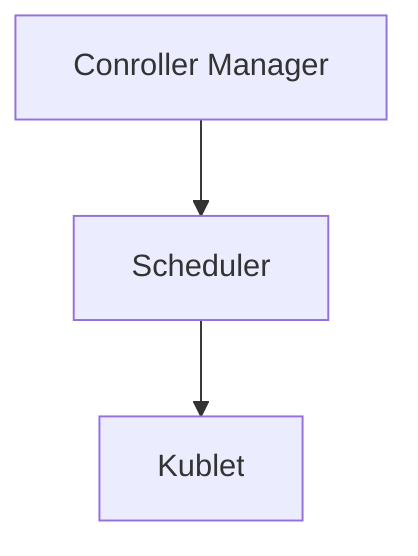

## Kubernetes Learnings 

## Playground (Envirnoment to test out Kubernetes)

- [labs.play-with-k8s.com](https://labs.play-with-k8s.com/)
- [killercoda.com/playgrounds](https://killercoda.com/playgrounds)

## Resources 

- [Docker Mastery: with Kubernetes +Swarm from a Docker Captain](https://www.udemy.com/course/docker-mastery/) Udemy course.
- [BretFisher/udemy-docker-mastery](https://github.com/BretFisher/udemy-docker-mastery) GitHub repo.
- Kubernetes official [docs](https://kubernetes.io/docs/home/)

## Concepts

## Kubernetes Components - architecture


<details>
  <summary>Simpler Image</summary>


</details>

### Master Node

- **API Server**: 
- **Etcd**: 
- **Scheduler**: Decide which worker node will be best to deploy next pods, after examin the resources and other para. It does not schedule it.
- **Controller Manager**: Detect current state of the cluster and keep the desrire state of pods running

Folow of request when somethings need to chnage/added on worker node



### Worker Node

- **Kubelet**:
- **Kube Proxy**
- **Container Runtime** 

#### Imperative Vs Declarative

- Imperative - When we give command though CLI to run pod/deplyment. For eg: `kubectl run nginx --image=nginx`

- Declrative - Creating deployment though YAML file. 

#### Namespaces

- Isolated environment to the tems. In this we can group resouces seprately like database. Also, great for running different versions of the app.

We can create namespace by

```
kubectl create namespace <name>
kubectl create namespace dev
```

#### Lables and selectors

Lables are for identification


#### Pod Lifecycle


## Configuration files

Generally A K8s YAML config file contain 4 properties

```YAML
apiVersion: 
kind:
metadata:
spec:
```

### Deployment

```yaml
apiVersion: apps/v1
kind: Deployment
metadata:
  name: mongo-deployment
  labels:
    app: mongodb
spec:
  replicas: 1
  selector:
    matchLabels:
      app: mongodb
  template:
    metadata:
      labels:
        app: mongodb
    spec:
      containers:
        - name: mongodb
          image: mongo
          ports:
            - containerPort: 27017
          env:
            - name: MONGO_INITDB_ROOT_USERNAME
              valueFrom:
                secretKeyRef:
                  name: mongodb-secrets
                  key: mongo-root-username  
            - name: MONGO_INITDB_ROOT_PASSWORD
              valueFrom: 
                secretKeyRef:
                  name: mongodb-secrets
                  key: mongo-root-password
```

### Services

Servies are for internal communtion of pods. It also help giving a pop static IP address

```yaml
apiVersion: v1
kind: Service
metadata:
  name: mongodb-service
spec:
  selector:
    app: mongodb //Deployment app lable
  ports:
    - protocol: TCP
      port: 27017 // Service Port
      targetPort: 27017 // Pod/Container Port
```

### ConfigMap

Use to store external configurations like database URL. We put in simple text forrmat unlike [Secrets](#secrets)

```yaml
apiVersion: v1
kind: ConfigMap
metadata:
  name: mongodb-configmap
data:
  database_url: mongodb-service
```

### Secrets

We use secrets to pass envirnoment variables inside the pods.

```yaml
apiVersion: v1
kind: Secret
metadata:
  name: mongodb-secrets
type: Opaque
data:
  mongo-root-username: cHJhZHVtbmE= //pradumna
  mongo-root-password: c2FyYWYxMjM= //saraf123
```

> Note: the serect value should be `base64` encoded, like `cHJhZHVtbmE` 

```bash
echo -n "value" | base64
```

### Cluster Config file

All the Cluster info are stored in file name `config` with the path:

```bash
~/.kube/config
```
