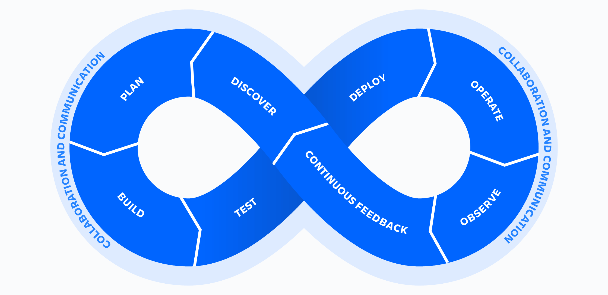

> Hey, I created this repository to keep my learning, notes, and code in one place for various tools in DevOps. Now, it's helping thousands of learners, practitioners, and professionals every day in their DevOps journey. Good luck with your DevOps journey! - [Pradumna Saraf](https://twitter.com/pradumna_saraf)

## What is DevOps?

DevOps is a set of practices that combines software development (Dev) and information technology operations (Ops) to shorten the systems development life cycle while providing continuous delivery with high software quality. DevOps is a culture, movement, or practice that emphasizes the collaboration and communication of both software developers and other information-technology (IT) professionals while automating the process of software delivery and infrastructure changes.

If you notice DevOps has a infinity symbol, which means it's a continuous process. It's not a one-time activity. It's a continuous process of development and operations. It's explained in the below image:

## DevOps Lifecycle

To understand the above image, let's break down the DevOps lifecycle into different stages:

**1. Discovery**: In this stage, the team identifies the requirements and the scope of the project.

**2. Plan**: In this stage, the team plans the project and creates a roadmap.

**3. Build/Develop**: In this stage, the team develops the software.

**4. Test**: In this stage, the team tests the software.

**5. Deploy**: In this stage, the team deploys the software.

**6. Operate**: In this stage, the team operates the software.

**7. Monitor/Observe**: In this stage, the team monitors the software.

**8. Continuous Feedback**: In this stage, the team gets feedback from the users and stakeholders.

## DevOps Tools

There are various tools available for different stages of the DevOps lifecycle. It depends on the requirements of the project and the team. Some of the popular DevOps tools are:

- **Source Code Management**: Git, GitHub, GitLab, Bitbucket.
- **Continuous Integration**: Jenkins, GitLab CI, CircleCI, Travis CI.
- **Continuous Deployment**: Jenkins, GitLab CI, CircleCI, Travis CI.
- **Configuration Management**: Ansible, Puppet, Chef, SaltStack.
- **Containerization**: Docker, Podman, Containerd, LXC.
- **Orchestration**: Kubernetes, Docker Swarm, Amazon ECS.
- **Monitoring**: Prometheus, Grafana, ELK Stack, Nagios.
- **Infrastructure as Code**: Terraform, AWS CloudFormation, Azure Resource Manager.
- **Security**: SonarQube, OWASP ZAP, Clair, Trivy.
- **Collaboration**: Slack, Microsoft Teams, Google Chat, Zoom.
  
To learn more about these tools, you can navigate to the respective sections in the sidebar.
