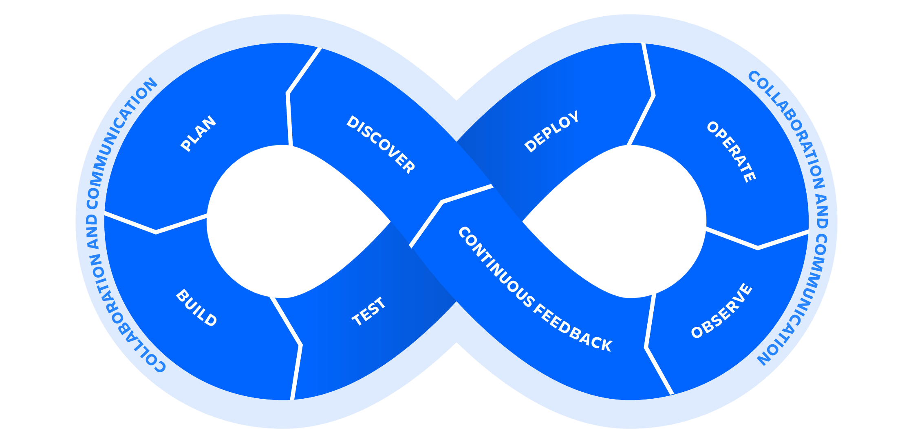

> Привет, я создал этот репозиторий, чтобы хранить в одном месте мое обучение, заметки и код по различным инструментам DevOps. Теперь он помогает тысячам учащихся, практиков и профессионалов каждый день в их DevOps путешествии. Удачи в вашем DevOps путешествии! - [Pradumna Saraf](https://twitter.com/pradumna_saraf)

## Что такое DevOps?

DevOps - это набор практик, который объединяет разработку программного обеспечения (Dev) и информационные технологии операций (Ops) для сокращения жизненного цикла разработки систем при обеспечении непрерывной поставки с высоким качеством программного обеспечения. DevOps - это культура, движение или практика, которая подчеркивает сотрудничество и коммуникацию как разработчиков программного обеспечения, так и других ИТ-профессионалов при автоматизации процесса поставки программного обеспечения и изменений инфраструктуры.

Если вы заметили, что DevOps имеет символ бесконечности, это означает, что это непрерывный процесс. Это не разовая деятельность. Это непрерывный процесс разработки и операций. Это объясняется на изображении ниже:

## Жизненный цикл DevOps

Чтобы понять изображение выше, давайте разберем жизненный цикл DevOps на различные этапы:

**1. Discovery (Обнаружение)**: На этом этапе команда определяет требования и объем проекта.

**2. Plan (Планирование)**: На этом этапе команда планирует проект и создает дорожную карту.

**3. Build/Develop (Сборка/Разработка)**: На этом этапе команда разрабатывает программное обеспечение.

**4. Test (Тестирование)**: На этом этапе команда тестирует программное обеспечение.

**5. Deploy (Развертывание)**: На этом этапе команда развертывает программное обеспечение.

**6. Operate (Эксплуатация)**: На этом этапе команда эксплуатирует программное обеспечение.

**7. Monitor/Observe (Мониторинг/Наблюдение)**: На этом этапе команда мониторит программное обеспечение.

**8. Continuous Feedback (Непрерывная обратная связь)**: На этом этапе команда получает обратную связь от пользователей и заинтересованных сторон.

## Инструменты DevOps

Существуют различные инструменты для разных этапов жизненного цикла DevOps. Это зависит от требований проекта и команды. Некоторые из популярных инструментов DevOps:

- **Source Code Management (Управление исходным кодом)**: Git, GitHub, GitLab, Bitbucket.
- **Continuous Integration (Непрерывная интеграция)**: Jenkins, GitLab CI, CircleCI, Travis CI.
- **Continuous Deployment (Непрерывное развертывание)**: Jenkins, GitLab CI, CircleCI, Travis CI.
- **Configuration Management (Управление конфигурацией)**: Ansible, Puppet, Chef, SaltStack.
- **Containerization (Контейнеризация)**: Docker, Podman, Containerd, LXC.
- **Orchestration (Оркестрация)**: Kubernetes, Docker Swarm, Amazon ECS.
- **Monitoring (Мониторинг)**: Prometheus, Grafana, ELK Stack, Nagios.
- **Infrastructure as Code (Инфраструктура как код)**: Terraform, AWS CloudFormation, Azure Resource Manager.
- **Security (Безопасность)**: SonarQube, OWASP ZAP, Clair, Trivy.
- **Collaboration (Сотрудничество)**: Slack, Microsoft Teams, Google Chat, Zoom.
  
Чтобы узнать больше об этих инструментах, вы можете перейти к соответствующим разделам в боковой панели.
