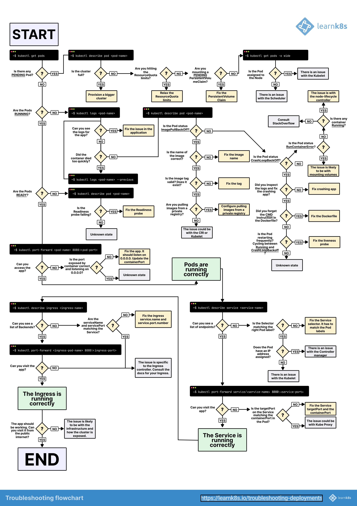

## Kubernetes Components - architecture


<details>
  <summary>Simpler Image</summary>

  

</details>

## Cluster

Cluster is collection of nodes. The nodes can be grouped into two categories, Control Plane and Data Plane. The Control Plane is responsible for runining all the Kubernetes components. The Data Plane is responsible for running the application (our application).

## Control Plane

Control Plane is the brain of the Kubernetes cluster. It is responsible for managing the cluster. It contains the Control plane nodes. And each control plane node contains the following components:

- **API Server**: It is the entry point for all the REST commands used to control the cluster. It is the only component that communicates with the etcd.
- **Etcd**: It stores the current state of the cluster. It's like a cluster brain.
- **Scheduler**: Decide which worker node will be best to deploy the next pods, after examining the resources and other paras. It does not schedule the pods, it just decides.
- **Controller Manager**: Detect the current state of the cluster and keep the desired state of pods running. Follow requests when some things need to change/added to a worker node
- **Cloud Controller Manager**: It Communicates with the cloud provider's API to create, delete, and update the resources.  

## Data Plane

Data Plane is responsible for running the application. It contains the worker nodes. And each worker node contains the following components:

- **Kubelet**: It is an agent that runs on each node in the cluster. It makes sure that the containers are running in a pod.
- **Kube Proxy**: Maintains network rules on the node, that allow network communication to your Pods from network sessions inside or outside of your cluster.
- **Container Runtime** - Like Docker, ContainerD, etc. Which runs the container

## CRI - Container Runtime Interface

It is a plugin interface that enables kubelet to use a wide variety of container runtimes, without the need to recompile the kubelet binary. It is a standard interface between Kubernetes and container runtimes. Previously, Docker was the default container runtime for Kubernetes and their was component called `dockershim` which was used to communicate with Docker. But it was removed in Kubernetes 1.20. and Docker is no longer the default container runtime. Now, the default container runtime is ContainerD. Popular choices are ContainerD, CRI-O, etc.

## CNI - Container Network Interface

It is a specification and libraries for writing plugins to configure network interfaces in Linux containers. It is used by Kubernetes to configure networking in the cluster. It is a standard interface between Kubernetes and the network plugins. It is used to set up networking in a container. Cloud providers like AWS, Azure, GCP have their own CNI plugins. Popular choices are Calico, Flannel, Cilium, etc.

### CSI - Container Storage Interface

It is a standard for exposing arbitrary block and file storage systems to containerized workloads on Kubernetes. It is used to provide persistent storage to the containers. It is a standard interface between Kubernetes and storage providers. It is used to provide persistent storage to the containers. Popular choices are Rook, OpenEBS, etc.

Custom Resource Definition - It allows you to define your own resources in Kubernetes. It extends the Kubernetes API. 

## Imperative Vs Declarative

- Imperative - When we give a command through CLI to run pod/deployment. For eg: `kubectl run nginx --image=nginx`

- Declarative - Creating deployment through YAML file. 

## Resources Configuration File Schema

Generally, a configuration file for Kubernetes resources has the following schema:

```YAML
apiVersion: # The version of the Kubernetes API you're using
kind: # The type of object you're creating
metadata: # Data that helps uniquely identify the object
spec: # The desired state of the object
```

## Namespaces

Isolated environment, we can group resources separately like a database. Also, great for running different versions of the app. By default, we have a namespace called `default`. We can create a new namespace by creating a YAML file.

NOTE: By default namespaces DO NOT provide any security and Networking Boundary. It is just a logical separation of resources.

We can create a namespace either by CLI or by 

```bash
kubectl create namespace <namespace-name>
```

or in a declarative way vy creating a YAML file and then applying it.

```yaml
apiVersion: v1
kind: Namespace
metadata:
  name: non-default-namespace
```

We can apply it by 

```bash
kubectl apply -f <filename>.yaml
```

Some useful commands for namespaces

```bash
kubectl get namespaces # To get all the namespaces
```

We can also switch the namespace by 

## Pods

The "smallest deployable unit" in Kubernetes. It is a group of one or more containers, with shared storage/network, and a specification for how to run the containers. It is the basic building block of Kubernetes.

It's not recommended to create a pod directly, instead, we should create a deployment, which will create a pod for us. But we can create a pod by 

```bash
kubectl run <pod-name> --image=<image-name>
```

Or by creating in a declarative way by creating a YAML file and then applying it.

```yaml
apiVersion: v1
kind: Pod
metadata:
  name: ngix-pod
  namespace: my-namespace
spec:
  containers:
  - name: nginx
    image: nginx:1.26.0
    ports:
    - containerPort: 80
```

Here is an example of a pod resource file with good practices:

```yaml
apiVersion: v1
kind: Pod
metadata: 
  name: nginx-pod-best-practices
  namespace: my-namespace
spec:
  containers:
  - name: nginx
    image: cgr.dev/chainguard/nginx:latest
    ports:
      - containerPort: 8080
        protocol: TCP
    readinessProbe:  # Check if the container is ready to serve traffic
      httpGet:
        path: /
        port: 8080
    resources: # Resource requests and limits
      requests:
        memory: "50Mi"
        cpu: "250m"
      limits:
        memory: "50Mi"
        cpu: "250m"
    securityContext:
      allowPrivilegeEscalation: false # Do not allow privilege escalation
      privileged: false # Do not run as a privileged container
  securityContext: # Pod security context (Above is container security context)
    seccompProfile:
      type: RuntimeDefault
    runAsUser: 1000
    runAsGroup: 1001
    runAsNonRoot: true # Run as non-root user
```

### Probes

Probes are used to check the health of the container. There are three types of probes:

- **Startup Probe**: It is used to check if the container is started. It is used to delay the liveness and readiness probes until the container is started.
- **Readiness Probe**: It is used to check if the container is ready to serve traffic. If the readiness probe fails, the container will not receive traffic. It is used to delay the traffic until the container is ready.
- **Liveness Probe**: It is used to check is in healthy state and able to serve traffic. If the liveness probe fails, the container will be restarted. It is used to restart the container if it is in an unhealthy state.

#### Startup Probe

```yaml
startupProbe:
  httpGet:
    path: /health
    port: 8080
  failureThreshold: 30 
  periodSeconds: 10
```

#### Readiness Probe

```yaml
readinessProbe:
  httpGet:
    path: /health
    port: 8080
  initialDelaySeconds: 3 # Wait for 3 seconds before starting the probe
  periodSeconds: 3 # Check every 3 seconds
  timeoutSeconds: 5 # Wait for 5 seconds before considering the probe as failed
  successThreshold: 1 # Mark the probe as successful after 1 success
  failureThreshold: 2 # Mark the probe as failed after 2 failures
---
readinessProbe:
  exec:
    command:
    - cat
    - /tmp/healthy
  initialDelaySeconds: 3 # Wait for 3 seconds before starting the probe
  periodSeconds: 3 # Check every 3 seconds
  timeoutSeconds: 5 # Wait for 5 seconds before considering the probe as failed
  successThreshold: 1 # Mark the probe as successful after 1 success
  failureThreshold: 2 # Mark the probe as failed after 2 failures
```

#### Liveness Probe

```yaml
livenessProbe:
  httpGet:
    path: /health
    port: 8080
  initialDelaySeconds: 3 # Wait for 3 seconds before starting the probe
  periodSeconds: 3 # Check every 3 seconds
  timeoutSeconds: 5 # Wait for 5 seconds before considering the probe as failed
  successThreshold: 1 # Mark the probe as successful after 1 success
  failureThreshold: 2 # Mark the probe as failed after 2 failures
```

### Pod Lifecycle


### Init Containers

The purpose of init containers is to run utility containers that can do some setup before the main container starts. They are run before the main container starts. They are run to completion. If the init container fails, the pod will not start. For example, setting up the environment, etc.

### Sidecar Containers

The purpose of sidecar containers is to extend and support the main container. They are run alongside the main container. They are used to extend the functionality of the main container. They are used to provide additional functionality to the main container. For example, logging, monitoring, etc.

Some useful commands for pods

```bash
Kubectl pods -A # (-all-namespaces) To get all the pods in all the namespaces
kubectl get pods -n <namespace-name> # To get all the pods in a nam
kubectl port-forward <pod-name> <localhost-port>:<pod-port> # To forward a port from a pod to our local machine
kubectl port-forward svc/<service-name> <localhost-port>:<service-port> # To forward a port from a service to our local machine
```

## ReplicaSet

ReplicaSet is a controller that ensures that a specified number of pod replicas are running at all times. It is a higher-level abstraction that manages the pods. It is a replacement for Replication Controller. It is a part of the Kubernetes deployment.

NOTE: Unlike the pods we don't create a ReplicaSet directly, instead, we create a deployment, which will create a ReplicaSet and underlying pods for us.

```yaml
apiVersion: apps/v1
kind: ReplicaSet
metadata:
  name: nginx-replicaset
  namespace: my-namespace
spec:
  replicas: 3
  selector:
    matchLabels:
      app: nginx-app # Select the pods with this label
  template:
    metadata:
      labels:
        app: nginx-app # Create a label for the pod not container
    spec:
      containers:
      - name: nginx
        image: nginx:1.26.0
        ports:
        - containerPort: 80
```

## Labels and Annotations

**Labels:** They are key-value pairs that are attached to objects. They are used to identify and select objects. Can also be used to filter objects.

```yaml
metadata:
  labels:
    app: myapp
```


**Annotations:** They are key-value pairs that are attached to objects. They are used to attach non-identifying metadata to objects. USed for things like config details, build information, etc. Often used by tools to configure specific behavior, like ingress annotations.

```yaml
metadata:
  annotations:
    foo: bar
```

The difference between the two is that labels are used to identify and select objects, while annotations are used to attach metadata to objects, like attaching a ingress class to an Ingress object. 

## Deployment

Deployment is a higher-level abstraction that manages ReplicaSets and provides declarative updates to pods. It is a way to declaratively manage the pods. It is a part of the Kubernetes deployment. It is a recommended way to create pods.

```yaml
apiVersion: apps/v1
kind: Deployment
metadata:
  name: nginx-minimal
spec:
  replicas: 3
  selector:
    matchLabels:
      app: nginx-minimal
  template:
    metadata:
      labels:
        app: nginx-minimal
    spec:
      containers:
      - name: nginx
        image: nginx:1.26.0
        ports:
        - containerPort: 80
```

## Services

Serves as an internal load balancer across the replicas. It uses pod labels to determine which pods to serve. 

### Types of Services

- **ClusterIP**: For inter communication of pods (Internal to Cluster)
- **NodePort**: Listen on each node in a cluster.
- **LoadBalancer**: Expose the service externally using the cloud provider's load balancer. 

Couple of things to NOTE:

- ClusterIP is the default type of service. It exposes the service on a cluster-internal IP. It is only reachable from within the cluster.
- If we don't specify the `targetPort` in the service, it will default to the same value as the `port`.
- If we don't specify the `nodePort` in the service, Kubernetes will assign a port within the range of 30000-32767.

#### ClusterIP

```yaml
apiVersion: v1
kind: Service
metadata:
  name: nginx-clusterip
  labels:
    foo: service-label
  annotations:
    bar: service-annotation
spec:
  type: ClusterIP # This is the default value
  selector:
    baz: pod-label
  ports:
    - protocol: TCP
      port: 80 # Port the service is listening on
      targetPort: 80 # Port the container is listening on (if unset, defaults to equal port value)
```

#### NodePort

```yaml
apiVersion: v1
kind: Service
metadata:
  name: nginx-nodeport
spec:
  type: NodePort
  selector:
    baz: pod-label
  ports:
    - protocol: TCP
      port: 80 # Port the service is listening on
      targetPort: 80 # Port the container is listening on (if unset, defaults to equal port value)
      # nodePort: 30XXX (if unset, kubernetes will assign a port within 30000-32767)
```

#### LoadBalancer

```yaml
apiVersion: v1
kind: Service
metadata:
  name: nginx-loadbalancer
spec:
  type: LoadBalancer # Will only work if cluster is configured to provision one from an external source (e.g. cloud provider)
  selector:
    baz: pod-label
  ports:
    - protocol: TCP
      port: 80 # Port the service is listening on
      targetPort: 80 # Port the container is listening on (if unset, defaults to equal port value)
```

Example of multi-port service

```yaml
apiVersion: v1
kind: Service
metadata:
  name: multi-port-service
spec:
  type: LoadBalancer
  selector:
    app: myapp
  ports:
    - name: http
      protocol: TCP
      port: 80
      targetPort: 80
    - name: https
      protocol: TCP
      port: 443
      targetPort: 443
```

### Headless Service

A headless service is a service with a cluster IP of None. It is used to disable the load balancing for the service. It is used to get the DNS records for the pods. It is used to get the DNS records for the pods. It is used to get the DNS records for the pods.

```yaml
apiVersion: v1
kind: Service
metadata:
  name: nginx-headless
spec:
  clusterIP: None
  selector:
    baz: pod-label
  ports:
    - protocol: TCP
      port: 80
      targetPort: 80
```

### ExternalName Service

An ExternalName service is a service that maps a service to a DNS name. It is used to map a service to a DNS name. It is used to map a service to a DNS name. It is used to map a service to a DNS name.


## Jobs

A Job creates one or more pods and ensures that a specified number of them successfully terminate. As pods successfully complete, the Job tracks the successful completions. When a specified number of successful completions is reached, the task (ie, Job) is complete. Deleting a Job will clean up the pods it created.

It might look similar to Pod, but the main difference is that it runs to completion and have certain features like `parallelism`, `completions`, `activeDeadlineSeconds`, `backoffLimit`, etc. In easy way we can say it is a higher level of abstraction than Pods.
```yaml
apiVersion: batch/v1
kind: Job
metadata:
  name: echo-date-job
spec:
  parallelism: 1 # Number of pods that should be created in parallel
  completions: 1 # Number of pods that should be created
  activeDeadlineSeconds: 100 # Time in seconds after which the Job will be terminated
  backoffLimit: 1 # Number of retries before considering a Job as failed
  template:
    spec:
      containers:
      - name: echo
        image: busybox:1.36.1
        command: [date]
      restartPolicy: Never # Never, OnFailure, Always
```  

## CronJobs

A CronJob creates Jobs on a repeating schedule. Like a Job, a CronJob creates one or more Jobs. However, a CronJob is used for creating Jobs that run on a repeating schedule, whereas a Job runs once and then is finished.

```yaml
apiVersion: batch/v1
kind: CronJob
metadata:
  name: echo-date-cronjob
spec:
  schedule: "*/1 * * * *" # Run every minute
  jobTemplate:
    spec:
      parallelism: 1
      completions: 1
      activeDeadlineSeconds: 100
      backoffLimit: 1
      template:
        spec:
          containers:
          - name: echo
            image: busybox:1.36.1
            command: [date]
          restartPolicy: Never
```

We can also create a Job from a CronJob spec by running below command. This cab help us to run the job immediately without waiting for the schedule. This also helps to check if the CronJob job is working as expected and you don't want to wait for the schedule.

```bash
kubectl create job --from=cronjob/<cronjob-name> <job-name>
```

## DaemonSet

DemonSet ensures that all nodes run a copy of a pod. It is used to run a copy of a pod on all or a subset of nodes in a cluster. It can be used for monitoring, logging, etc.

NOTE: It will run on all worker nodes, except the master node.

```yaml
apiVersion: apps/v1
kind: DaemonSet
metadata:
  name: fluentd-daemonset
spec:
  selector:
    matchLabels:
      app: fluentd-app
  template:
    metadata:
      labels:
        app: fluentd-app
    spec:
      containers:
      - name: fluentd
        image: fluentd:v1.16-1
```

## StatefulSet

StatefulSet is a controller that manages the deployment and scaling of a set of pods. It is used to run stateful applications. It is used to run applications that require stable, unique network identifiers, stable storage, and ordered deployment and scaling.

`serviceName` is used to create a headless service. We need to create a headless service while creating a StatefulSet. The purpose of the headless service is that it allows a client to connect to whichever pod it prefers. 

Another great thing about the StatefulSet is that pod naming is predictable. The pod name is in the format `<statefulset-name>-<ordinal>`. The ordinal is a unique number assigned to each pod. So, fo below example, the pod names will be `nginx-statefulset-0`, `nginx-statefulset-1`, `nginx-statefulset-2`.

Also, similar kind of naming convention is follow by PVCs. The PVC name is in the format `<volume-claim-template-name>-<statefulset-name>-<ordinal>`. So, for below example, the PVC names will be `data-nginx-statefulset-0`, `data-nginx-statefulset-1`, `data-nginx-statefulset-2`.

The way the below config is working that the init container will run before the main container. The init container will populate the default HTML file in the volume and then the main container will use that volume to serve the HTML file.

```yaml
apiVersion: apps/v1
kind: StatefulSet
metadata: 
  name: nginx-statefulset
spec:
  serviceName: nginxs # Headless service
  replicas: 3
  selector:
    matchLabels:
      app: nginx-app
  template:
    metadata:
      labels:
        app: nginx-app 
    spec:
      initContainers:
        - name: populate-default-html
          image: nginx:1.26.0
          command:
            - bash
            - "-c"
            - |
              set -ex
              [[ $HOSTNAME =~ -([0-9]+)$ ]] || exit 1
              ordinal=${BASH_REMATCH[1]}
              echo "<h1>Hello from pod $ordinal</h1>" >  /usr/share/nginx/html/index.html
          volumeMounts:
            - name: data
              mountPath: /usr/share/nginx/html
      containers:
        - name: nginx
          image: nginx:1.26.0
          volumeMounts:
            - name: data
              mountPath: /usr/share/nginx/html

  volumeClaimTemplates: # PersistentVolumeClaim templates for each replica
    - metadata:
        name: data
      spec:
        accessModes: ["ReadWriteOnce"]
        storageClassName: "standard"
        resources:
          requests:
            storage: 100Mi
---
apiVersion: v1
kind: Service
metadata:
  name: nginxs
spec:
  clusterIP: None # Headless service
  selector:
    app: nginx-app
```

## ConfigMap

ConfigMap enables environment specific configuration to be decoupled from the container image. It is used to store non-sensitive data in key-value pairs.

Thee are two ways to primary style to create a ConfigMap:

- Property like Keys (MYAPP_COLOR=blue) - This is useful when we want to use the ConfigMap as environment variables.
- File like Keys `(conf.yml = <multi line string>)` - This is useful when we want to use the ConfigMap as a file.


File like style:

```yaml
apiVersion: v1
kind: ConfigMap
metadata:
  name: file-like-keys
data:
  conf.yml: |
    name: YourAppName
    version: 1.0.0
    author: YourName

---

apiVersion: v1
kind: Pod
metadata:
  name: configmap-example-file
spec:
  containers:
    - name: nginx
      image: nginx:1.26.0
      volumeMounts:
        - name: configmap-file-like-keys
          mountPath: /etc/config
  volumes:
    - name: configmap-file-like-keys
      configMap:
        name: file-like-keys
```

Property like style:

```yaml
apiVersion: v1
kind: ConfigMap
metadata:
  name: property-like-keys
data:
  NAME: YourAppName
  VERSION: 1.0.0
  AUTHOR: YourName

---

apiVersion: v1
kind: Pod
metadata:
  name: configmap-example-key
spec:
  containers:
    - name: nginx
      image: nginx:1.26.0
      envFrom:
        - configMapRef:
            name: property-like-keys
```

## Secrets

Secrets are similar to ConigMap but Data is stored in base64 encoded format. This is support binary data and is NOT a security mechanism to protect sensitive data.

```yaml
apiVersion: v1
kind: Secret
metadata:
  name: string-data
type: Opaque # This is the default type
stringData:
  foo: bar
  baz: qux

--- 
apiVersion: v1
kind: Pod
metadata:
  name: secret-example
spec:
  containers:
    - name: nginx
      image: nginx:1.26.0
      envFrom:
        - secretRef:
            name: string-data

```

> Note: the secret value can be `base64` encoded, like `cHJhZHVtbmE` 

To encode a value in base64, we can use the below command

```bash
echo -n "value" | base64
```

To decode a value in base64, we can use the below command

```bash 
echo cHJhZHVtbmE | base64 --decode
```

Also, there is specific type of secret is `dockerconfigjson` which is used to store the docker registry credentials. It is used to store the docker registry credentials in a secret.

```yaml
apiVersion: v1
kind: Secret
metadata:
  name: dockerconfigjson
type: kubernetes.io/dockerconfigjson
data:
  .dockerconfigjson: |
    <base64 encoded docker config.json> 
```

Kubectl has a build-in command to create a secret from the docker config.json file.

```sh
kubectl create secret docker-registry dockerconfigjson --docker-server=<server> --docker-username=<username> --docker-password=<password> --docker-email=<email>
```

## Ingress

Ingress enables routing traffic to services based on the request host or path. It is an API object that manages external access to services in a cluster, typically HTTP. It provides HTTP and HTTPS routing to services in a cluster.

The way it works it that the traffic from the client comes to the Ingress Controller, then the Ingress Controller routes the traffic to the respective service according to the rules and then the service routes the traffic to the respective pod. `Traffic -> Ingress Controller -> Service -> Pod`

Some common ingress controllers are Nginx (below example), Traefik, etc. Some support annotations to configure the routing and some have their Ingress Class name.

NOTE: One things to note here is it only supports layer 7 routing that is HTTP/HTTPS.

```yaml
apiVersion: networking.k8s.io/v1
kind: Ingress
metadata:
  name: nginx-ingress-ingress
spec:
  ingressClassName: nginx # Ingress controller name
  rules:
  - host: mydomain.com # Domain name
    http:
      paths:
        - path: /
          pathType: Prefix
          backend:
            service:
              name: nginx-ingress-service # Service name
              port:
                number: 80 # Service port
```

### Gateway API

It's a evolution of Ingress. It's add supports for Layer 4 routing, TCP, UDP, etc.

```yaml
apiVersion: gateway.networking.k8s.io/v1beta1
kind: Gateway
metadata:
  name: nginx-gateway
spec:
  - gatewayClassName: nginx
    listeners:
      - name: http
        protocol: HTTP
        port: 80
        allowedRoutes:
          kind:
            - kind: HTTPRoute

---

apiVersion: gateway.networking.k8s.io/v1alpha1
kind: HTTPRoute
metadata:
  name: nginx-gateway-httproute
spec:
  parentRefs:
    - name: nginx-gateway
  hostnames:
    - example.com
  rules:
    - matches:  
        - path:
          type: Prefix
          value: /
      backend:
        - name: nginx-gateway-service
          servicePort: 80
```

## Persistent Volume and Persistent Volume Claim

It provides API for creating, managing, and using storage in a cluster. It is used to provide storage to the pods. It lives beyond the live of an individual pod.

**Persistent Volume**: It is a piece of storage in the cluster that has been provisioned by an administrator. It is a storage resource in the cluster.

**Persistent Volume Claim**: It is a request for storage by a user. It is a request for storage by a user. It is a way to claim a Persistent Volume.

### Access Modes

The access mode is used to specify how the volume can be mounted. 

- **ReadWriteOnce**: The volume can be mounted as read-write by a single node.
- **ReadWriteOncePod**: The volume can be mounted as read-write by a single pod.
- **ReadOnlyMany**: The volume can be mounted read-only by many nodes.
- **ReadWriteMany**: The volume can be mounted as read-write by many nodes.

Some more important points to note:

- In case of `deployment` if we specify PVC all the pods will share the same PVC. But in of `statefulset`, each pod will have its own independent PVC.

```yaml
apiVersion: v1
kind: PersistentVolume
metadata:
  name: my-pv
spec:
  capacity:
    storage: 1Gi
  volumeMode: Filesystem
  accessModes:
    - ReadWriteOnce
  persistentVolumeReclaimPolicy: Retain
  storageClassName: standard
  hostPath:
    path: /data
---
apiVersion: v1
kind: PersistentVolumeClaim
metadata:
  name: my-pvc
spec:
  accessModes:
    - ReadWriteOnce
  resources:
    requests:
      storage: 1Gi
  storageClassName: standard
```

### Reclaim Policy

Reclaim policy is used to specify what should happen to the volume after the Persistent Volume Claim is deleted. 

- **Retain**: Retain the volume after the Persistent Volume Claim is deleted.
- **Delete**: Delete the volume after the Persistent Volume Claim is deleted.

### PersistentVolumeClaim Retention Policy

We can also specify the PersistentVolumeClaim retention policy in the StatefulSet. We can specify the behavior of the PersistentVolumeClaim when the StatefulSet is deleted or scaled down by the consumer.

**whenDeleted**: This is the behavior when a statefulset is deleted.
**whenScaled**: This is the behavior when the replicas count of StatefulSet is reduced.

```yaml
apiVersion: apps/v1
kind: StatefulSet
...
spec:
  persistentVolumeReclaimPolicy:
    whenDeleted: Retain # 
    whenScaled: Delete # 
```

## Role-Based Access Control (RBAC)

It is used to control access to the Kubernetes API. It is used to control who can access the Kubernetes API and what they can do. It's also used to access Kubernetes API within the Kubernetes cluster.

For example if we need tro give permission to a Job to get all the pods across the namespaces, we can create a Role and RoleBinding for that. We also need to create a ServiceAccount for the Job.

```yaml
apiVersion: v1
kind: ServiceAccount
metadata:
  name: cluster-pod-reader
--- 
apiVersion: rbac.authorization.k8s.io/v1
kind: ClusterRole # ClusterRole is used to access the Kubernetes API
metadata:
  name: pod-reader
rules:
- apiGroups: [""] # "" indicates the core API group
  resources: ["pods"] # Resource type
  verbs: ["get", "watch", "list"] # Actions
---
apiVersion: rbac.authorization.k8s.io/v1
kind: ClusterRoleBinding
metadata:
  name: pod-reader
roleRef:
  apiGroup: rbac.authorization.k8s.io
  kind: ClusterRole
  name: pod-reader
subjects:
  - kind: ServiceAccount
    name: cluster-pod-reader
    namespace: rbac
---
apiVersion: batch/v1
kind: Job
metadata:
  name: job-no-perms
spec:
  template:
    spec:
      automountServiceAccountToken: true # To mount the service account token
      containers:
      - name: kubectl
        image: cgr.dev/chainguard/kubectl
        args: ["get", "pods", "-A"]
      serviceAccountName: cluster-pod-reader # Service account name
      restartPolicy: Never
  backoffLimit: 1
```

## Cluster Configuration

The Cluster info is stored in the file name `config` with the path:

```bash
~/.kube/config
```

When we have multiple configurations, we can specify the path of the kubeconfig file by setting the environment variable `KUBECONFIG`.

```bash
export KUBECONFIG=~/.kube/config:~/.kube/config2
```

We can also merge the kubeconfig files by using the below command.

```bash
kubectl config view --flatten > ~/.kube/config
```

To switch the context, we can use the below command.

```bash
kubectl config use-context <context-name>
```

To make cluster switching easier we can use a tool called `kubectx` and `kubens`.


## Secret Management 

There are many ways to manage secrets in Kubernetes. Some of the ways are

- **Secrets**: It is used to store sensitive information in the cluster. It is used to store sensitive information in the cluster. It is used to store sensitive information in the cluster. (NOT RECOMMENDED, DON'T GO WITH THE NAME)
- **External Secrets**: It is used to store secrets in an external secret manager like AWS Secrets Manager, GCP Secret Manager, etc.
- **Sealed Secrets**: It is used to store encrypted secrets in the cluster. It is used to store encrypted secrets in the cluster. It is used to store encrypted secrets in the cluster.
- **Vault**: It is used to store secrets in an external secret manager like HashiCorp Vault. Some 

## Troubleshooting

There are many ways to troubleshoot the Kubernetes cluster. Here a flow chart to understand the approach and options while troubleshooting the Kubernetes cluster Deployment issues.



## Kustomize

Kustomize is a tool to customize Kubernetes configurations. It is used to customize, share, and manage Kubernetes configurations. It is used to manage Kubernetes configurations in a declarative way. It can help us achieve different configurations for different environments.

Check out [Kustomize Page](./tools/kustomize/introduction.md) for more details.

## Cluster Upgrade Process

The process of upgrading a Kubernetes cluster is a complex process. It involves upgrading the control plane components, upgrading the worker nodes, and upgrading the add-ons. We can use tools like `kubent` to check the compatibility of the Kubernetes version with the add-ons.

One of the Process to upgrade the cluster is:

For eg your Node Group is running on 1.21.0 and you want to upgrade it to 1.22.0. First we will create another Node Group with 1.22.0 and then we shift load and traffic to the new Node Group. Once the new Node Group is stable, we can delete the old Node Group. 

## Continuos Integration

CI/CD is a practice that enables the automation of the software delivery process. It is used to automate the the process like:

- Linting, testing, validating the code
- Build the container image
- Push the container image to the registry

Some of the popular CI/CD tools are Jenkins, GitLab CI, GitHub Actions, etc.

## Continuos Deployment

CD is a practice that enables the automation of the software delivery process. I more like how we can bring those changes to the Kubernetes cluster.
It is used to automate the process like:

- Update Kubernetes resources
- Apply Updated manifests to the cluster
- Validate deployment worked as expected

## Deployment Update Strategies

Update strategies are used to update the pods in a deployment. They can be responsible for how the pods are updated and their availability during the update. Also, different strategies have different affect on the availability of the service and downtime.

Some of the common update strategies are:

- **Recreate**: It deletes all the pods and then creates new pods. It is the fastest way to update the pods. But it has downtime. In this strategy, all the pods are deleted and then new pods are created. So there is downtime during the update.
- **Rolling Update**: It updates the pods one by one and ensures that the service is always up. It is the default strategy. The new pod is created and the old pod is deleted. So the service is always up.
- **Blue-Green Deployment**: In Blue-Green Deployment, we have two identical environments. One is the production environment and the other is the staging environment. The traffic is routed to the staging environment and then the traffic is switched to the production environment.
- **Canary Deployment**: In Canary Deployment, a small number of users are redirected to the new version of the application. It is used to test the new version of the application before rolling it out to all users.

### Rolling Update

In Rolling Update, it updates the pods one by one and ensures that the service is always up. It is the default strategy. The new pod is created and the old pod is deleted. So the service is always up.

```yaml
apiVersion: apps/v1
kind: Deployment
metadata:
  namespace: deployment-strategies
  name: rollingupdate-deployment
spec:
  strategy:
    type: RollingUpdate # This is the default
    rollingUpdate:
      maxUnavailable: 25% # Maximum number of pods that can be unavailable during the update
      # maxUnavailable: 1 # We can also provide a fix number of pods instead of percentage
      maxSurge: 25% # Maximum number of pods that can be created above the desired number of pods
      # maxSurge: 1 # We can also provide a fix number of pods instead of percentage
  replicas: 10
  selector:
    matchLabels:
      app: rollingupdate-app
  template:
    metadata:
      labels:
        app: rollingupdate-app
    spec:
      containers:
        - name: nginx-app
          # image: pradumnasaraf/nginx:green
          image: pradumnasaraf/nginx:blue
          ports:
            - name: http
              containerPort: 80
          startupProbe:
            httpGet:
              port: 80
            initialDelaySeconds: 20
            periodSeconds: 5
```

`kubectl` also rollout command to manage the deployment. We can use the below command to check the rollout status. We can check history, pause, resume, undo, etc. It's valid on the resources like Deployment, StatefulSet, DaemonSet, etc.

For example, to check the rollout status of the deployment, we can use the below command.

```bash
kubectl rollout status deployment <deployment-name>
```

### Recreate

In Recreate, it deletes all the pods and then creates new pods. It is the fastest way to update the pods. But it has downtime. In this strategy, all the pods are deleted and then new pods are created. So there is downtime during the update. It is used mostly in the development environment. Sometime become necessary due to limited resources.

```yaml
apiVersion: apps/v1
kind: Deployment
metadata:
  namespace: deployment-strategies
  name: rollingupdate-deployment
spec:
  strategy:
    type: Recreate
  replicas: 10
  selector:
    matchLabels:
      app: rollingupdate-app
  template:
    metadata:
      labels:
        app: rollingupdate-app
    spec:
      containers:
        - name: nginx-app
          image: pradumnasaraf/nginx:green
          # image: pradumnasaraf/nginx:blue
          ports:
            - name: http
              containerPort: 80
          startupProbe:
            httpGet:
              port: 80
            initialDelaySeconds: 20
            periodSeconds: 5
---

```

### Blue-Green Deployment

In Blue-Green Deployment, we have two identical environments. One is the production environment and the other is the staging environment. The traffic is routed to the staging environment and then the traffic is switched to the production environment.

Below is an example of Blue-Green Deployment. We have two deployments, one is the blue deployment and the other is the green deployment. The traffic is routed to the blue deployment. Once the green deployment is ready, the traffic is switched to the green deployment. Because both labels needs to satisfy the service selector, we can switch the traffic by changing the label of the service.

```yaml
# Blue Deployment (Blue.Deployment.yaml)
apiVersion: apps/v1
kind: Deployment
metadata:
  namespace: deployment-strategies
  name: blue-deployment
spec:
  replicas: 4
  selector:
    matchLabels:
      app: nginx-app
      replica: blue
  template:
    metadata:
      labels:
        app: nginx-app
        replica: blue
    spec:
      containers:
        - name: nginx-app
          image: pradumnasaraf/nginx:blue
          ports:
            - name: http
              containerPort: 80
          startupProbe:
            httpGet:
              port: 80
            initialDelaySeconds: 20
            periodSeconds: 5
---
# Green Deployment (Green.Deployment.yaml)
apiVersion: apps/v1
kind: Deployment
metadata:
  namespace: deployment-strategies
  name: green-deployment
spec:
  replicas: 4
  selector:
    matchLabels:
      app: nginx-app
      replica: green
  template:
    metadata:
      labels:
        app: nginx-app
        replica: green
    spec:
      containers:
        - name: nginx-app
          image: pradumnasaraf/nginx:green
          ports:
            - name: http
              containerPort: 80
          startupProbe:
            httpGet:
              port: 80
            initialDelaySeconds: 20
            periodSeconds: 5
---
# Service (Service.yaml)
apiVersion: v1
kind: Service
metadata:
  namespace: deployment-strategies
  name: nginx-service
spec:
  selector:
    app: nginx-app
    replica: blue # We can switch traffic to green by changing the label to green
  ports:
    - name: http
      port: 80
      targetPort: 80
```

### Canary Deployment

In Canary Deployment, a small number of users are redirected to the new version of the application. It is used to test the new version of the application before rolling it out to all users.

```yaml
apiVersion: apps/v1
kind: Deployment
metadata:
  namespace: deployment-strategies
  name: canary-deployment
spec:
  replicas: 4
  selector:
    matchLabels:
      app: nginx-app
  template:
    metadata:
      labels:
        app: nginx-app
    spec:
      containers:
        - name: nginx-app
          image: pradumnasaraf/nginx:blue
          ports:
            - name: http
              containerPort: 80
          startupProbe:
            httpGet:
              port: 80
            initialDelaySeconds: 20
            periodSeconds: 5
---
apiVersion: service/v1
kind: Service
metadata:
  namespace: deployment-strategies
  name: nginx-service
spec:
  selector:
    app: nginx-app
  ports:
    - name: http
      port: 80
      targetPort: 80
```

## Pod Communication

Inside a Kubernetes cluster, pods can communicate with each other using the service and DNS. The service is used to expose the pods to the other pods. The DNS is used to resolve the service names to the IP addresses.

For communicating with a Pod in the same Namespace, we can use the below command. It can be reached at

```
<service-name>.svc.cluster.local
```

For communicating with a Pod in the different Namespace, we can use the below command. It can be reached at

```
<service-name>.<namespace>.svc.cluster.local
```

## What's next?

- [Commands](./commands.md) - Learn about the commands that you can use with Kubernetes.
- [Learning Resources](./learning-resources.md) - Learn more about Kubernetes with these resources.
- [Other Resources](./other-resources.md) - Explore more about Kubernetes with these resources.
- [Playground](./playground.md) - Play with Kubernetes in the browser.
  
<!--
## CustomResourceDefinition (CRD)
## LimitRange
## NetworkPolicy
-->