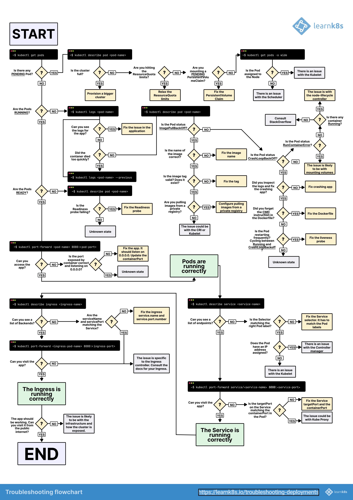

## Компоненты Kubernetes - архитектура


<details>
  <summary>Упрощенное изображение</summary>

  

</details>

## Кластер

Кластер - это коллекция узлов. Узлы могут быть сгруппированы в две категории: Control Plane и Data Plane. Control Plane отвечает за запуск всех компонентов Kubernetes. Data Plane отвечает за запуск приложения (нашего приложения).

## Control Plane

Control Plane - это мозг кластера Kubernetes. Он отвечает за управление кластером. Он содержит узлы Control Plane. И каждый узел Control Plane содержит следующие компоненты:

- **API Server**: Это точка входа для всех REST команд, используемых для управления кластером. Это единственный компонент, который общается с etcd.
- **Etcd**: Он хранит текущее состояние кластера. Это как мозг кластера.
- **Scheduler**: Решает, какой рабочий узел будет лучшим для развертывания следующих подов, после изучения ресурсов и других параметров. Он не планирует поды, он просто решает.
- **Controller Manager**: Обнаруживает текущее состояние кластера и поддерживает желаемое состояние подов в рабочем состоянии. Следует запросам, когда что-то нужно изменить/добавить к рабочему узлу
- **Cloud Controller Manager**: Он общается с API облачного провайдера для создания, удаления и обновления ресурсов.  

## Data Plane

Data Plane отвечает за запуск приложения. Он содержит рабочие узлы. И каждый рабочий узел содержит следующие компоненты:

- **Kubelet**: Это агент, который работает на каждом узле в кластере. Он обеспечивает работу контейнеров в поде.
- **Kube Proxy**: Поддерживает сетевые правила на узле, которые позволяют сетевую связь с вашими подами из сетевых сессий внутри или снаружи вашего кластера.
- **Container Runtime** - Как Docker, ContainerD и т.д. Который запускает контейнер

## CRI - Container Runtime Interface

Это интерфейс плагина, который позволяет kubelet использовать широкий спектр сред выполнения контейнеров без необходимости перекомпиляции двоичного файла kubelet. Это стандартный интерфейс между Kubernetes и средами выполнения контейнеров. Ранее Docker был средой выполнения контейнеров по умолчанию для Kubernetes, и был компонент, называемый `dockershim`, который использовался для связи с Docker. Но он был удален в Kubernetes 1.20, и Docker больше не является средой выполнения контейнеров по умолчанию. Теперь средой выполнения контейнеров по умолчанию является ContainerD. Популярные выборы - ContainerD, CRI-O и т.д.

## CNI - Container Network Interface

Это спецификация и библиотеки для написания плагинов для настройки сетевых интерфейсов в Linux контейнерах. Он используется Kubernetes для настройки сети в кластере. Это стандартный интерфейс между Kubernetes и сетевыми плагинами. Он используется для настройки сети в контейнере. Облачные провайдеры, такие как AWS, Azure, GCP, имеют свои собственные CNI плагины. Популярные выборы - Calico, Flannel, Cilium и т.д.

### CSI - Container Storage Interface

Это стандарт для предоставления произвольных блочных и файловых систем хранения контейнеризированным рабочим нагрузкам на Kubernetes. Он используется для предоставления постоянного хранилища контейнерам. Это стандартный интерфейс между Kubernetes и провайдерами хранилищ. Он используется для предоставления постоянного хранилища контейнерам. Популярные выборы - Rook, OpenEBS и т.д.

Custom Resource Definition - Он позволяет вам определять собственные ресурсы в Kubernetes. Он расширяет API Kubernetes. 

## Императивный vs Декларативный

- Императивный - Когда мы даем команду через CLI для запуска пода/deployment. Например: `kubectl run nginx --image=nginx`

- Декларативный - Создание deployment через YAML файл. 

## Схема файла конфигурации ресурсов

Как правило, файл конфигурации для ресурсов Kubernetes имеет следующую схему:

```YAML
apiVersion: # Версия API Kubernetes, которую вы используете
kind: # Тип объекта, который вы создаете
metadata: # Данные, которые помогают однозначно идентифицировать объект
spec: # Желаемое состояние объекта
```

## Namespaces

Изолированная среда, мы можем группировать ресурсы отдельно, как база данных. Также отлично подходит для запуска разных версий приложения. По умолчанию у нас есть namespace, называемый `default`. Мы можем создать новый namespace, создав YAML файл.

ПРИМЕЧАНИЕ: По умолчанию namespaces НЕ предоставляют никакой безопасности и сетевой границы. Это просто логическое разделение ресурсов.

Мы можем создать namespace либо через CLI, либо через

```bash
kubectl create namespace <namespace-name>
```

или декларативным способом, создав YAML файл и затем применив его.

```yaml
apiVersion: v1
kind: Namespace
metadata:
  name: non-default-namespace
```

Мы можем применить его через

```bash
kubectl apply -f <filename>.yaml
```

Некоторые полезные команды для namespaces

```bash
kubectl get namespaces # Чтобы получить все namespace
```

Мы также можем переключить namespace через

## Pods

Наименьшая деплойруемая единица в Kubernetes. Это группа одного или нескольких контейнеров, с общим хранилищем/сетевым интерфейсом, и спецификацией для запуска контейнеров. Это базовая единица для Kubernetes.

Не рекомендуется создавать пода напрямую, вместо этого мы должны создать deployment, который создаст пода для нас. Но мы можем создать пода через

```bash
kubectl run <pod-name> --image=<image-name>
```

или декларативным способом, создав YAML файл и затем применив его.

```yaml
apiVersion: v1
kind: Pod
metadata:
  name: ngix-pod
  namespace: my-namespace
spec:
  containers:
  - name: nginx
    image: nginx:1.26.0
    ports:
    - containerPort: 80
```

Вот пример файла ресурса пода с хорошими практиками:

```yaml
apiVersion: v1
kind: Pod
metadata: 
  name: nginx-pod-best-practices
  namespace: my-namespace
spec:
  containers:
  - name: nginx
    image: cgr.dev/chainguard/nginx:latest
    ports:
      - containerPort: 8080
        protocol: TCP
    readinessProbe:  # Проверяет, готов ли контейнер к обслуживанию трафика
      httpGet:
        path: /
        port: 8080
    resources: # Запросы ресурсов и лимиты
      requests:
        memory: "50Mi"
        cpu: "250m"
      limits:
        memory: "50Mi"
        cpu: "250m"
    securityContext:
      allowPrivilegeEscalation: false # Не разрешать привилегированное повышение
      privileged: false # Не запускать как привилегированный контейнер
  securityContext: # Контекст безопасности пода (выше - контекст безопасности контейнера)
    seccompProfile:
      type: RuntimeDefault
    runAsUser: 1000
    runAsGroup: 1001
    runAsNonRoot: true # Запускать как непривилегированный пользователь
```

### Пробы

Пробы используются для проверки здоровья контейнера. Существует три типа проб:

- **Startup Probe**: Используется для проверки запуска контейнера. Он используется для задержки проб liveness и readiness probes до запуска контейнера.
- **Readiness Probe**: Используется для проверки готовности контейнера к обслуживанию трафика. Если проб readiness провалена, контейнер не получит трафик. Он используется для задержки трафика до запуска контейнера.
- **Liveness Probe**: Используется для проверки здоровья и способности обслуживать трафик. Если проб liveness провалена, контейнер будет перезапущен. Он используется для перезапуска контейнера, если он находится в нездоровом состоянии.

#### Startup Probe

```yaml
startupProbe:
  httpGet:
    path: /health
    port: 8080
  failureThreshold: 30 
  periodSeconds: 10
```

#### Readiness Probe

```yaml
readinessProbe:
  httpGet:
    path: /health
    port: 8080
  initialDelaySeconds: 3 # Ждать 3 секунды перед запуском пробы
  periodSeconds: 3 # Проверять каждые 3 секунды
  timeoutSeconds: 5 # Ждать 5 секунд перед тем, как считать пробу неудачной
  successThreshold: 1 # Отметить пробу как успешную после 1 успеха
  failureThreshold: 2 # Отметить пробу как неудачную после 2 неудач
---
readinessProbe:
  exec:
    command:
    - cat
    - /tmp/healthy
  initialDelaySeconds: 3 # Ждать 3 секунды перед запуском пробы
  periodSeconds: 3 # Проверять каждые 3 секунды
  timeoutSeconds: 5 # Ждать 5 секунд перед тем, как считать пробу неудачной
  successThreshold: 1 # Отметить пробу как успешную после 1 успеха
  failureThreshold: 2 # Отметить пробу как неудачную после 2 неудач
```

#### Liveness Probe

```yaml
livenessProbe:
  httpGet:
    path: /health
    port: 8080
  initialDelaySeconds: 3 # Ждать 3 секунды перед запуском пробы
  periodSeconds: 3 # Проверять каждые 3 секунды
  timeoutSeconds: 5 # Ждать 5 секунд перед тем, как считать пробу неудачной
  successThreshold: 1 # Отметить пробу как успешную после 1 успеха
  failureThreshold: 2 # Отметить пробу как неудачную после 2 неудач
```

### Жизненный цикл пода


### Init Containers

Цель init containers - это запуск утилитных контейнеров, которые могут выполнить некоторые настройки перед запуском основного контейнера. Они запускаются перед запуском основного контейнера. Они запускаются до завершения. Если init container провален, пода не запустится. Например, настройка окружения и т.д.

### Sidecar Containers

Цель sidecar контейнеров - это расширение и поддержка основного контейнера. Они запускаются рядом с основным контейнером. Они используются для расширения функциональности основного контейнера. Они используются для предоставления дополнительных функций основного контейнера. Например, логирование, мониторинг и т.д.

Некоторые полезные команды для пода

```bash
Kubectl pods -A # (-all-namespaces) Чтобы получить все пода во всех namespace
kubectl get pods -n <namespace-name> # Чтобы получить все пода в namespace
kubectl port-forward <pod-name> <localhost-port>:<pod-port> # Чтобы перенаправить порт из пода на нашу локальную машину
kubectl port-forward svc/<service-name> <localhost-port>:<service-port> # Чтобы перенаправить порт из сервиса на нашу локальную машину
```

## ReplicaSet

ReplicaSet - это контроллер, который обеспечивает, что указанное количество подов реплик запущено всегда. Это более высокий уровень абстракции, который управляет подами. Это замена Replication Controller. Это часть Kubernetes deployment.

ПРИМЕЧАНИЕ: В отличие от подов мы не создаем ReplicaSet напрямую, вместо этого мы создаем deployment, который создаст ReplicaSet и базовые подов для нас.

```yaml
apiVersion: apps/v1
kind: ReplicaSet
metadata:
  name: nginx-replicaset
  namespace: my-namespace
spec:
  replicas: 3
  selector:
    matchLabels:
      app: nginx-app # Выберите подов с этим лейблом
  template:
    metadata:
      labels:
        app: nginx-app # Создайте лейбл для пода, а не для контейнера
    spec:
      containers:
      - name: nginx
        image: nginx:1.26.0
        ports:
        - containerPort: 80
```

## Labels и Annotations

**Labels:** Они являются парами ключ-значение, прикрепленными к объектам. Они используются для идентификации и выбора объектов. Также могут использоваться для фильтрации объектов.

```yaml
metadata:
  labels:
    app: myapp
```


**Annotations:** Они являются парами ключ-значение, прикрепленными к объектам. Они используются для прикрепления неидентифицирующих метаданных к объектам. Используется для вещей, таких как детали конфигурации, информация о сборке и т.д. Часто используется инструментами для настройки специфического поведения, например, аннотации ingress.

```yaml
metadata:
  annotations:
    foo: bar
```

Разница между ними в том, что лейблы используются для идентификации и выбора объектов, а аннотации используются для прикрепления метаданных к объектам, например, прикрепление класса ingress к объекту Ingress. 

## Deployment

Deployment - это более высокий уровень абстракции, который управляет ReplicaSets и предоставляет декларативные обновления для подов. Это способ декларативного управления подами. Это часть Kubernetes deployment. Это рекомендуемый способ создания пода.

```yaml
apiVersion: apps/v1
kind: Deployment
metadata:
  name: nginx-minimal
spec:
  replicas: 3
  selector:
    matchLabels:
      app: nginx-minimal
  template:
    metadata:
      labels:
        app: nginx-minimal
    spec:
      containers:
      - name: nginx
        image: nginx:1.26.0
        ports:
        - containerPort: 80
```

## Services

Служит как внутренний балансировщик нагрузки по всем репликам. Он использует метки подов для определения, какие подов обслуживать. 

### Типы сервисов

- **ClusterIP**: Для внутренней связи подов (внутри кластера)
- **NodePort**: Слушает на каждом узле в кластере.
- **LoadBalancer**: Экспортирует сервис внешним образом с помощью облачного провайдера балансировщика нагрузки. 

Несколько вещей, которые нужно ПРИМЕЧАНИЕ:

- ClusterIP - это тип сервиса по умолчанию. Он экспортирует сервис по внутреннему IP кластера. Он доступен только изнутри кластера.
- Если мы не указываем `targetPort` в сервисе, он по умолчанию будет равен `port`.
- Если мы не указываем `nodePort` в сервисе, Kubernetes назначит порт в диапазоне 30000-32767.

#### ClusterIP

```yaml
apiVersion: v1
kind: Service
metadata:
  name: nginx-clusterip
  labels:
    foo: service-label
  annotations:
    bar: service-annotation
spec:
  type: ClusterIP # Это значение по умолчанию
  selector:
    baz: pod-label
  ports:
    - protocol: TCP
      port: 80 # Порт, на котором сервис слушает
      targetPort: 80 # Порт, на котором контейнер слушает (если не установлен, по умолчанию равен значению порта)
```

#### NodePort

```yaml
apiVersion: v1
kind: Service
metadata:
  name: nginx-nodeport
spec:
  type: NodePort
  selector:
    baz: pod-label
  ports:
    - protocol: TCP
      port: 80 # Порт, на котором сервис слушает
      targetPort: 80 # Порт, на котором контейнер слушает (если не установлен, по умолчанию равен значению порта)
      # nodePort: 30XXX (если не установлен, kubernetes назначит порт в диапазоне 30000-32767)
```

#### LoadBalancer

```yaml
apiVersion: v1
kind: Service
metadata:
  name: nginx-loadbalancer
spec:
  type: LoadBalancer # Будет работать только если кластер настроен для предоставления одного из внешних источников (например, облачного провайдера)
  selector:
    baz: pod-label
  ports:
    - protocol: TCP
      port: 80 # Порт, на котором сервис слушает
      targetPort: 80 # Порт, на котором контейнер слушает (если не установлен, по умолчанию равен значению порта)
```

Пример многопортового сервиса

```yaml
apiVersion: v1
kind: Service
metadata:
  name: multi-port-service
spec:
  type: LoadBalancer
  selector:
    app: myapp
  ports:
    - name: http
      protocol: TCP
      port: 80
      targetPort: 80
    - name: https
      protocol: TCP
      port: 443
      targetPort: 443
```

### Headless Service

Headless service - это сервис с Cluster IP равным None. Он используется для отключения балансировки нагрузки для сервиса. Он используется для получения DNS записей подов. Он используется для получения DNS записей подов. Он используется для получения DNS записей подов.

```yaml
apiVersion: v1
kind: Service
metadata:
  name: nginx-headless
spec:
  clusterIP: None
  selector:
    baz: pod-label
  ports:
    - protocol: TCP
      port: 80
      targetPort: 80
```

### ExternalName Service

ExternalName service - это сервис, который отображает сервис на DNS имя. Он используется для отображения сервиса на DNS имя. Он используется для отображения сервиса на DNS имя. Он используется для отображения сервиса на DNS имя.


## Jobs

Job создает один или несколько подов и гарантирует, что указанное количество из них успешно завершается. По мере успешного завершения подов Job отслеживает успешные завершения. Когда достигается указанное количество успешных завершений, задача (т.е., Job) завершается. Удаление Job очищает подов, которые он создал.

Это может выглядеть похоже на пода, но основное отличие в том, что он запускается до завершения и имеет определенные функции, такие как `parallelism`, `completions`, `activeDeadlineSeconds`, `backoffLimit`, и т.д. В простом виде мы можем сказать, что это более высокий уровень абстракции, чем подов.
```yaml
apiVersion: batch/v1
kind: Job
metadata:
  name: echo-date-job
spec:
  parallelism: 1 # Количество подов, которые должны быть созданы параллельно
  completions: 1 # Количество подов, которые должны быть созданы
  activeDeadlineSeconds: 100 # Время в секундах после которого Job будет завершен
  backoffLimit: 1 # Количество попыток перед тем, как считать Job неудачным
  template:
    spec:
      containers:
      - name: echo
        image: busybox:1.36.1
        command: [date]
      restartPolicy: Never # Never, OnFailure, Always
```  

## CronJobs

CronJob создает Jobs по повторяющемуся расписанию. Как Job, CronJob создает один или несколько Jobs. Однако CronJob используется для создания Jobs, которые работают по повторяющемуся расписанию, в то время как Job запускается один раз и затем завершается.

```yaml
apiVersion: batch/v1
kind: CronJob
metadata:
  name: echo-date-cronjob
spec:
  schedule: "*/1 * * * *" # Запускать каждую минуту
  jobTemplate:
    spec:
      parallelism: 1
      completions: 1
      activeDeadlineSeconds: 100
      backoffLimit: 1
      template:
        spec:
          containers:
          - name: echo
            image: busybox:1.36.1
            command: [date]
          restartPolicy: Never
```

Мы также можем создать Job из спецификации CronJob, запустив ниже команду. Это может помочь нам запустить задачу сразу, без ожидания расписания. Это также помогает проверить, работает ли CronJob job как ожидалось, и вы не хотите ждать расписания.

```bash
kubectl create job --from=cronjob/<cronjob-name> <job-name>
```

## DaemonSet

DaemonSet гарантирует, что на всех узлах запущен копию пода. Он используется для запуска копии пода на всех или подмножестве узлов в кластере. Он может использоваться для мониторинга, логирования и т.д.

ПРИМЕЧАНИЕ: Он будет запущен на всех рабочих узлах, кроме мастер-узла.

```yaml
apiVersion: apps/v1
kind: DaemonSet
metadata:
  name: fluentd-daemonset
spec:
  selector:
    matchLabels:
      app: fluentd-app
  template:
    metadata:
      labels:
        app: fluentd-app
    spec:
      containers:
      - name: fluentd
        image: fluentd:v1.16-1
```

## StatefulSet

StatefulSet - это контроллер, который управляет развертыванием и масштабированием набора подов. Он используется для запуска stateful приложений. Он используется для запуска приложений, которые требуют стабильные, уникальные сетевые идентификаторы, стабильное хранилище и упорядоченное развертывание и масштабирование.

`serviceName` используется для создания headless сервиса. Нам нужно создать headless сервис при создании StatefulSet. Цель headless сервиса заключается в том, чтобы позволить клиенту подключиться к тому пода, который он предпочитает.

Еще одна замечательная вещь о StatefulSet заключается в том, что имена подов предсказуемы. Имя пода в формате `<statefulset-name>-<ordinal>`. Ординал - это уникальный номер, назначенный каждому пода. Таким образом, для примера ниже, имена подов будут `nginx-statefulset-0`, `nginx-statefulset-1`, `nginx-statefulset-2`.

Также следует такое же соглашение об именовании для PVCs. Имя PVC в формате `<volume-claim-template-name>-<statefulset-name>-<ordinal>`. Таким образом, для примера ниже, имена PVC будут `data-nginx-statefulset-0`, `data-nginx-statefulset-1`, `data-nginx-statefulset-2`.

The way the below config is working that the init container will run before the main container. The init container will populate the default HTML file in the volume and then the main container will use that volume to serve the HTML file.

```yaml
apiVersion: apps/v1
kind: StatefulSet
metadata: 
  name: nginx-statefulset
spec:
  serviceName: nginxs # Headless service
  replicas: 3
  selector:
    matchLabels:
      app: nginx-app
  template:
    metadata:
      labels:
        app: nginx-app 
    spec:
      initContainers:
        - name: populate-default-html
          image: nginx:1.26.0
          command:
            - bash
            - "-c"
            - |
              set -ex
              [[ $HOSTNAME =~ -([0-9]+)$ ]] || exit 1
              ordinal=${BASH_REMATCH[1]}
              echo "<h1>Hello from pod $ordinal</h1>" >  /usr/share/nginx/html/index.html
          volumeMounts:
            - name: data
              mountPath: /usr/share/nginx/html
      containers:
        - name: nginx
          image: nginx:1.26.0
          volumeMounts:
            - name: data
              mountPath: /usr/share/nginx/html

  volumeClaimTemplates: # PersistentVolumeClaim templates for each replica
    - metadata:
        name: data
      spec:
        accessModes: ["ReadWriteOnce"]
        storageClassName: "standard"
        resources:
          requests:
            storage: 100Mi
---
apiVersion: v1
kind: Service
metadata:
  name: nginxs
spec:
  clusterIP: None # Headless service
  selector:
    app: nginx-app
```

## ConfigMap

ConfigMap enables environment specific configuration to be decoupled from the container image. It is used to store non-sensitive data in key-value pairs.

Thee are two ways to primary style to create a ConfigMap:

- Property like Keys (MYAPP_COLOR=blue) - This is useful when we want to use the ConfigMap as environment variables.
- File like Keys `(conf.yml = <multi line string>)` - This is useful when we want to use the ConfigMap as a file.


File like style:

```yaml
apiVersion: v1
kind: ConfigMap
metadata:
  name: file-like-keys
data:
  conf.yml: |
    name: YourAppName
    version: 1.0.0
    author: YourName

---

apiVersion: v1
kind: Pod
metadata:
  name: configmap-example-file
spec:
  containers:
    - name: nginx
      image: nginx:1.26.0
      volumeMounts:
        - name: configmap-file-like-keys
          mountPath: /etc/config
  volumes:
    - name: configmap-file-like-keys
      configMap:
        name: file-like-keys
```

Property like style:

```yaml
apiVersion: v1
kind: ConfigMap
metadata:
  name: property-like-keys
data:
  NAME: YourAppName
  VERSION: 1.0.0
  AUTHOR: YourName

---

apiVersion: v1
kind: Pod
metadata:
  name: configmap-example-key
spec:
  containers:
    - name: nginx
      image: nginx:1.26.0
      envFrom:
        - configMapRef:
            name: property-like-keys
```

## Secrets

Secrets are similar to ConigMap but Data is stored in base64 encoded format. This is support binary data and is NOT a security mechanism to protect sensitive data.

```yaml
apiVersion: v1
kind: Secret
metadata:
  name: string-data
type: Opaque # This is the default type
stringData:
  foo: bar
  baz: qux

--- 
apiVersion: v1
kind: Pod
metadata:
  name: secret-example
spec:
  containers:
    - name: nginx
      image: nginx:1.26.0
      envFrom:
        - secretRef:
            name: string-data

```

> Note: the secret value can be `base64` encoded, like `cHJhZHVtbmE` 

To encode a value in base64, we can use the below command

```bash
echo -n "value" | base64
```

To decode a value in base64, we can use the below command

```bash 
echo cHJhZHVtbmE | base64 --decode
```

Also, there is specific type of secret is `dockerconfigjson` which is used to store the docker registry credentials. It is used to store the docker registry credentials in a secret.

```yaml
apiVersion: v1
kind: Secret
metadata:
  name: dockerconfigjson
type: kubernetes.io/dockerconfigjson
data:
  .dockerconfigjson: |
    <base64 encoded docker config.json> 
```

Kubectl has a build-in command to create a secret from the docker config.json file.

```sh
kubectl create secret docker-registry dockerconfigjson --docker-server=<server> --docker-username=<username> --docker-password=<password> --docker-email=<email>
```

## Ingress

Ingress enables routing traffic to services based on the request host or path. It is an API object that manages external access to services in a cluster, typically HTTP. It provides HTTP and HTTPS routing to services in a cluster.

The way it works it that the traffic from the client comes to the Ingress Controller, then the Ingress Controller routes the traffic to the respective service according to the rules and then the service routes the traffic to the respective pod. `Traffic -> Ingress Controller -> Service -> Pod`

Some common ingress controllers are Nginx (below example), Traefik, etc. Some support annotations to configure the routing and some have their Ingress Class name.

NOTE: One things to note here is it only supports layer 7 routing that is HTTP/HTTPS.

```yaml
apiVersion: networking.k8s.io/v1
kind: Ingress
metadata:
  name: nginx-ingress-ingress
spec:
  ingressClassName: nginx # Ingress controller name
  rules:
  - host: mydomain.com # Domain name
    http:
      paths:
        - path: /
          pathType: Prefix
          backend:
            service:
              name: nginx-ingress-service # Service name
              port:
                number: 80 # Service port
```

### Gateway API

It's a evolution of Ingress. It's add supports for Layer 4 routing, TCP, UDP, etc.

```yaml
apiVersion: gateway.networking.k8s.io/v1beta1
kind: Gateway
metadata:
  name: nginx-gateway
spec:
  - gatewayClassName: nginx
    listeners:
      - name: http
        protocol: HTTP
        port: 80
        allowedRoutes:
          kind:
            - kind: HTTPRoute

---

apiVersion: gateway.networking.k8s.io/v1alpha1
kind: HTTPRoute
metadata:
  name: nginx-gateway-httproute
spec:
  parentRefs:
    - name: nginx-gateway
  hostnames:
    - example.com
  rules:
    - matches:  
        - path:
          type: Prefix
          value: /
      backend:
        - name: nginx-gateway-service
          servicePort: 80
```

## Persistent Volume and Persistent Volume Claim

It provides API for creating, managing, and using storage in a cluster. It is used to provide storage to the pods. It lives beyond the live of an individual pod.

**Persistent Volume**: It is a piece of storage in the cluster that has been provisioned by an administrator. It is a storage resource in the cluster.

**Persistent Volume Claim**: It is a request for storage by a user. It is a request for storage by a user. It is a way to claim a Persistent Volume.

### Access Modes

The access mode is used to specify how the volume can be mounted. 

- **ReadWriteOnce**: The volume can be mounted as read-write by a single node.
- **ReadWriteOncePod**: The volume can be mounted as read-write by a single pod.
- **ReadOnlyMany**: The volume can be mounted read-only by many nodes.
- **ReadWriteMany**: The volume can be mounted as read-write by many nodes.

Some more important points to note:

- In case of `deployment` if we specify PVC all the pods will share the same PVC. But in of `statefulset`, each pod will have its own independent PVC.

```yaml
apiVersion: v1
kind: PersistentVolume
metadata:
  name: my-pv
spec:
  capacity:
    storage: 1Gi
  volumeMode: Filesystem
  accessModes:
    - ReadWriteOnce
  persistentVolumeReclaimPolicy: Retain
  storageClassName: standard
  hostPath:
    path: /data
---
apiVersion: v1
kind: PersistentVolumeClaim
metadata:
  name: my-pvc
spec:
  accessModes:
    - ReadWriteOnce
  resources:
    requests:
      storage: 1Gi
  storageClassName: standard
```

### Reclaim Policy

Reclaim policy is used to specify what should happen to the volume after the Persistent Volume Claim is deleted. 

- **Retain**: Retain the volume after the Persistent Volume Claim is deleted.
- **Delete**: Delete the volume after the Persistent Volume Claim is deleted.

### PersistentVolumeClaim Retention Policy

We can also specify the PersistentVolumeClaim retention policy in the StatefulSet. We can specify the behavior of the PersistentVolumeClaim when the StatefulSet is deleted or scaled down by the consumer.

**whenDeleted**: This is the behavior when a statefulset is deleted.
**whenScaled**: This is the behavior when the replicas count of StatefulSet is reduced.

```yaml
apiVersion: apps/v1
kind: StatefulSet
...
spec:
  persistentVolumeReclaimPolicy:
    whenDeleted: Retain # 
    whenScaled: Delete # 
```

## Role-Based Access Control (RBAC)

It is used to control access to the Kubernetes API. It is used to control who can access the Kubernetes API and what they can do. It's also used to access Kubernetes API within the Kubernetes cluster.

For example if we need tro give permission to a Job to get all the pods across the namespaces, we can create a Role and RoleBinding for that. We also need to create a ServiceAccount for the Job.

```yaml
apiVersion: v1
kind: ServiceAccount
metadata:
  name: cluster-pod-reader
--- 
apiVersion: rbac.authorization.k8s.io/v1
kind: ClusterRole # ClusterRole is used to access the Kubernetes API
metadata:
  name: pod-reader
rules:
- apiGroups: [""] # "" indicates the core API group
  resources: ["pods"] # Resource type
  verbs: ["get", "watch", "list"] # Actions
---
apiVersion: rbac.authorization.k8s.io/v1
kind: ClusterRoleBinding
metadata:
  name: pod-reader
roleRef:
  apiGroup: rbac.authorization.k8s.io
  kind: ClusterRole
  name: pod-reader
subjects:
  - kind: ServiceAccount
    name: cluster-pod-reader
    namespace: rbac
---
apiVersion: batch/v1
kind: Job
metadata:
  name: job-no-perms
spec:
  template:
    spec:
      automountServiceAccountToken: true # To mount the service account token
      containers:
      - name: kubectl
        image: cgr.dev/chainguard/kubectl
        args: ["get", "pods", "-A"]
      serviceAccountName: cluster-pod-reader # Service account name
      restartPolicy: Never
  backoffLimit: 1
```

## Cluster Configuration

The Cluster info is stored in the file name `config` with the path:

```bash
~/.kube/config
```

When we have multiple configurations, we can specify the path of the kubeconfig file by setting the environment variable `KUBECONFIG`.

```bash
export KUBECONFIG=~/.kube/config:~/.kube/config2
```

We can also merge the kubeconfig files by using the below command.

```bash
kubectl config view --flatten > ~/.kube/config
```

To switch the context, we can use the below command.

```bash
kubectl config use-context <context-name>
```

To make cluster switching easier we can use a tool called `kubectx` and `kubens`.


## Secret Management 

There are many ways to manage secrets in Kubernetes. Some of the ways are

- **Secrets**: It is used to store sensitive information in the cluster. It is used to store sensitive information in the cluster. It is used to store sensitive information in the cluster. (NOT RECOMMENDED, DON'T GO WITH THE NAME)
- **External Secrets**: It is used to store secrets in an external secret manager like AWS Secrets Manager, GCP Secret Manager, etc.
- **Sealed Secrets**: It is used to store encrypted secrets in the cluster. It is used to store encrypted secrets in the cluster. It is used to store encrypted secrets in the cluster.
- **Vault**: It is used to store secrets in an external secret manager like HashiCorp Vault. Some 

## Troubleshooting

There are many ways to troubleshoot the Kubernetes cluster. Here a flow chart to understand the approach and options while troubleshooting the Kubernetes cluster Deployment issues.



## Kustomize

Kustomize is a tool to customize Kubernetes configurations. It is used to customize, share, and manage Kubernetes configurations. It is used to manage Kubernetes configurations in a declarative way. It can help us achieve different configurations for different environments.

Check out [Kustomize Page](./tools/kustomize/introduction.md) for more details.

## Cluster Upgrade Process

The process of upgrading a Kubernetes cluster is a complex process. It involves upgrading the control plane components, upgrading the worker nodes, and upgrading the add-ons. We can use tools like `kubent` to check the compatibility of the Kubernetes version with the add-ons.

One of the Process to upgrade the cluster is:

For eg your Node Group is running on 1.21.0 and you want to upgrade it to 1.22.0. First we will create another Node Group with 1.22.0 and then we shift load and traffic to the new Node Group. Once the new Node Group is stable, we can delete the old Node Group. 

## Continuos Integration

CI/CD is a practice that enables the automation of the software delivery process. It is used to automate the the process like:

- Linting, testing, validating the code
- Build the container image
- Push the container image to the registry

Some of the popular CI/CD tools are Jenkins, GitLab CI, GitHub Actions, etc.

## Continuos Deployment

CD is a practice that enables the automation of the software delivery process. I more like how we can bring those changes to the Kubernetes cluster.
It is used to automate the process like:

- Update Kubernetes resources
- Apply Updated manifests to the cluster
- Validate deployment worked as expected

## Deployment Update Strategies

Update strategies are used to update the pods in a deployment. They can be responsible for how the pods are updated and their availability during the update. Also, different strategies have different affect on the availability of the service and downtime.

Some of the common update strategies are:

- **Recreate**: It deletes all the pods and then creates new pods. It is the fastest way to update the pods. But it has downtime. In this strategy, all the pods are deleted and then new pods are created. So there is downtime during the update.
- **Rolling Update**: It updates the pods one by one and ensures that the service is always up. It is the default strategy. The new pod is created and the old pod is deleted. So the service is always up.
- **Blue-Green Deployment**: In Blue-Green Deployment, we have two identical environments. One is the production environment and the other is the staging environment. The traffic is routed to the staging environment and then the traffic is switched to the production environment.
- **Canary Deployment**: In Canary Deployment, a small number of users are redirected to the new version of the application. It is used to test the new version of the application before rolling it out to all users.

### Rolling Update

In Rolling Update, it updates the pods one by one and ensures that the service is always up. It is the default strategy. The new pod is created and the old pod is deleted. So the service is always up.

```yaml
apiVersion: apps/v1
kind: Deployment
metadata:
  namespace: deployment-strategies
  name: rollingupdate-deployment
spec:
  strategy:
    type: RollingUpdate # This is the default
    rollingUpdate:
      maxUnavailable: 25% # Maximum number of pods that can be unavailable during the update
      # maxUnavailable: 1 # We can also provide a fix number of pods instead of percentage
      maxSurge: 25% # Maximum number of pods that can be created above the desired number of pods
      # maxSurge: 1 # We can also provide a fix number of pods instead of percentage
  replicas: 10
  selector:
    matchLabels:
      app: rollingupdate-app
  template:
    metadata:
      labels:
        app: rollingupdate-app
    spec:
      containers:
        - name: nginx-app
          # image: pradumnasaraf/nginx:green
          image: pradumnasaraf/nginx:blue
          ports:
            - name: http
              containerPort: 80
          startupProbe:
            httpGet:
              port: 80
            initialDelaySeconds: 20
            periodSeconds: 5
```

`kubectl` also rollout command to manage the deployment. We can use the below command to check the rollout status. We can check history, pause, resume, undo, etc. It's valid on the resources like Deployment, StatefulSet, DaemonSet, etc.

For example, to check the rollout status of the deployment, we can use the below command.

```bash
kubectl rollout status deployment <deployment-name>
```

### Recreate

In Recreate, it deletes all the pods and then creates new pods. It is the fastest way to update the pods. But it has downtime. In this strategy, all the pods are deleted and then new pods are created. So there is downtime during the update. It is used mostly in the development environment. Sometime become necessary due to limited resources.

```yaml
apiVersion: apps/v1
kind: Deployment
metadata:
  namespace: deployment-strategies
  name: rollingupdate-deployment
spec:
  strategy:
    type: Recreate
  replicas: 10
  selector:
    matchLabels:
      app: rollingupdate-app
  template:
    metadata:
      labels:
        app: rollingupdate-app
    spec:
      containers:
        - name: nginx-app
          image: pradumnasaraf/nginx:green
          # image: pradumnasaraf/nginx:blue
          ports:
            - name: http
              containerPort: 80
          startupProbe:
            httpGet:
              port: 80
            initialDelaySeconds: 20
            periodSeconds: 5
---

```

### Blue-Green Deployment

In Blue-Green Deployment, we have two identical environments. One is the production environment and the other is the staging environment. The traffic is routed to the staging environment and then the traffic is switched to the production environment.

Below is an example of Blue-Green Deployment. We have two deployments, one is the blue deployment and the other is the green deployment. The traffic is routed to the blue deployment. Once the green deployment is ready, the traffic is switched to the green deployment. Because both labels needs to satisfy the service selector, we can switch the traffic by changing the label of the service.

```yaml
# Blue Deployment (Blue.Deployment.yaml)
apiVersion: apps/v1
kind: Deployment
metadata:
  namespace: deployment-strategies
  name: blue-deployment
spec:
  replicas: 4
  selector:
    matchLabels:
      app: nginx-app
      replica: blue
  template:
    metadata:
      labels:
        app: nginx-app
        replica: blue
    spec:
      containers:
        - name: nginx-app
          image: pradumnasaraf/nginx:blue
          ports:
            - name: http
              containerPort: 80
          startupProbe:
            httpGet:
              port: 80
            initialDelaySeconds: 20
            periodSeconds: 5
---
# Green Deployment (Green.Deployment.yaml)
apiVersion: apps/v1
kind: Deployment
metadata:
  namespace: deployment-strategies
  name: green-deployment
spec:
  replicas: 4
  selector:
    matchLabels:
      app: nginx-app
      replica: green
  template:
    metadata:
      labels:
        app: nginx-app
        replica: green
    spec:
      containers:
        - name: nginx-app
          image: pradumnasaraf/nginx:green
          ports:
            - name: http
              containerPort: 80
          startupProbe:
            httpGet:
              port: 80
            initialDelaySeconds: 20
            periodSeconds: 5
---
# Service (Service.yaml)
apiVersion: v1
kind: Service
metadata:
  namespace: deployment-strategies
  name: nginx-service
spec:
  selector:
    app: nginx-app
    replica: blue # We can switch traffic to green by changing the label to green
  ports:
    - name: http
      port: 80
      targetPort: 80
```

### Canary Deployment

In Canary Deployment, a small number of users are redirected to the new version of the application. It is used to test the new version of the application before rolling it out to all users.

```yaml
apiVersion: apps/v1
kind: Deployment
metadata:
  namespace: deployment-strategies
  name: canary-deployment
spec:
  replicas: 4
  selector:
    matchLabels:
      app: nginx-app
  template:
    metadata:
      labels:
        app: nginx-app
    spec:
      containers:
        - name: nginx-app
          image: pradumnasaraf/nginx:blue
          ports:
            - name: http
              containerPort: 80
          startupProbe:
            httpGet:
              port: 80
            initialDelaySeconds: 20
            periodSeconds: 5
---
apiVersion: service/v1
kind: Service
metadata:
  namespace: deployment-strategies
  name: nginx-service
spec:
  selector:
    app: nginx-app
  ports:
    - name: http
      port: 80
      targetPort: 80
```

## Pod Communication

Inside a Kubernetes cluster, pods can communicate with each other using the service and DNS. The service is used to expose the pods to the other pods. The DNS is used to resolve the service names to the IP addresses.

For communicating with a Pod in the same Namespace, we can use the below command. It can be reached at

```
<service-name>.svc.cluster.local
```

For communicating with a Pod in the different Namespace, we can use the below command. It can be reached at

```
<service-name>.<namespace>.svc.cluster.local
```

## What's next?

- [Commands](./commands.md) - Learn about the commands that you can use with Kubernetes.
- [Learning Resources](./learning-resources.md) - Learn more about Kubernetes with these resources.
- [Other Resources](./other-resources.md) - Explore more about Kubernetes with these resources.
- [Playground](./playground.md) - Play with Kubernetes in the browser.
  
<!--
## CustomResourceDefinition (CRD)
## LimitRange
## NetworkPolicy
-->