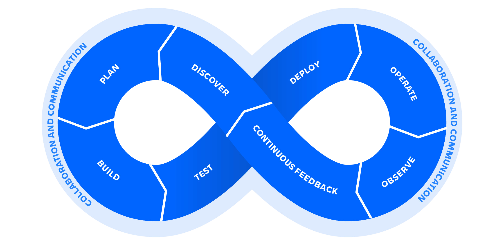

> Привет, Я создал репозитарий для хранения моих учебный записей, кода для различных инструментов DevOps в одном месте. Сейчас
!я помогаю тысячам ученикам, практикам и проффессионалам каждый день в их Devops пути! Желаю удачи в DevOps!
 - [Pradumna Saraf](https://twitter.com/pradumna_saraf)

 > Привет, от переводчиков, я также как и Прадумна Сараф, создал сообщество RoboInterativo c целью помогать людям в их
 пути от системного администратора до DevOps. Хотя английский язык это издержки проффессии, для многих главным барьером
 в проффессии является - языковой барьер. Надеюсь что наш перевод окажется полезным.
 я помогаю тысячам ученикам, практикам и проффессионалам каждый день в их Devops пути! Желаю удачи в DevOps!
  - [Алексей Шило и Тимур Галанин ](https://wiki.roboInterativo.org)

## Что такое devops?

DevOps is a set of practices that combines software development (Dev) and information technology operations (Ops) to shorten the systems development life cycle while providing continuous delivery with high software quality. DevOps is a culture, movement, or practice that emphasizes the collaboration and communication of both software developers and other information-technology (IT) professionals while automating the process of software delivery and infrastructure changes.

If you notice DevOps has a infinity symbol, which means it's a continuous process. It's not a one-time activity. It's a continuous process of development and operations. It's explained in the below image:

## DevOps Lifecycle

To understand the above image, let's break down the DevOps lifecycle into different stages:

**1. Исследование (Discovery)**: In this stage, the team identifies the requirements and the scope of the project.

**2. Планирование Plan**: In this stage, the team plans the project and creates a roadmap.

**3. Сборка/Разработка (Build/Develop)**: In this stage, the team develops the software.

**4. Тестирование Test**: In this stage, the team tests the software.

**5. Развертывание Deploy**: In this stage, the team deploys the software.

**6. Работа, оперирование(Operate)**: In this stage, the team operates the software.

**7. Мониторинг (Monitor/Observe)**: In this stage, the team monitors the software.

**8. Обратная связь(Continuous Feedback)**: In this stage, the team gets feedback from the users and stakeholders.

## DevOps Tools

Существует множество инструментов ждя разных этапов жизненого цикла DevOps. Это зависит от требований проекта и
командны. Вот некоторые популярные инстументы Devops..

- **Управление исходным кодом (Source Code Management)**: Git, GitHub, GitLab, Bitbucket.
- **Непрерывная Интеграция (Continuous Integration)**: Jenkins, GitLab CI, CircleCI, Travis CI.
- **Непрервное Развертывание (Continuous Deployment)**: Jenkins, GitLab CI, CircleCI, Travis CI.
- **Управление конфигурацией (Configuration Management)**: Ansible, Puppet, Chef, SaltStack.
- **Контейнеризация**: Docker, Podman, Containerd, LXC.
- **Оркестраторы**: Kubernetes, Docker Swarm, Amazon ECS.
- **Мониторинг**: Prometheus, Grafana, ELK Stack, Nagios.
- **Инфраструктура как код(Infrastructure as Code)**: Terraform, AWS CloudFormation, Azure Resource Manager.
- **Безопасность**: SonarQube, OWASP ZAP, Clair, Trivy.
- **Совместная работа**: Slack, Microsoft Teams, Google Chat, Zoom.

To learn more about these tools, you can navigate to the respective sections in the sidebar.
