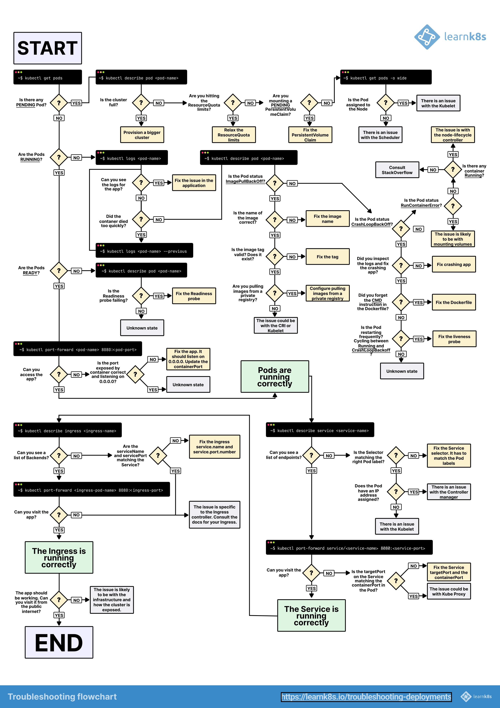

## Компоненты Kubernetes - архитектура


<details>
  <summary>Упрощенное изображение</summary>


</details>

## Cluster

Кластер — это узлов. Узлы можно разделить на две категории: управляющая плоскость (Control Plane) и рабочая плоскость (Data Plane). Управляющая плоскость отвечает за запуск всех компонентов Kubernetes. Рабочая плоскость отвечает за выполнение приложения (нашего приложения).

## Control Plane

Управляющая плоскость (Control Plane) — это "мозг" кластера Kubernetes. Она отвечает за управление кластером. Она состоит из узлов управляющей плоскости. Каждый узел управляющей плоскости содержит следующие компоненты:

- **API Server**: Это входная точка для всех команд REST, используемых для управления кластером. Это единственный компонент, который взаимодействует с etcd.
- **Etcd**: Он хранит текущее состояние кластера. Это похоже на "мозг" кластера.
- **Scheduler**: Определяет, какой рабочий узел будет лучше всего подходить для развертывания следующих подов, после анализа ресурсов и других параметров. Он не осуществляет планирование подов, а лишь принимает решения.
- **Controller Manager**: Обнаруживает текущее состояние кластера и поддерживает желаемое состояние подов в рабочем состоянии. Реагирует на запросы, когда необходимо изменить или добавить что-то на рабочий узел.
- **Cloud Controller Manager**: Общается с API облачного провайдера для создания, удаления и обновления ресурсов.

## Data Plane

Data Plane отвечает за выполнение приложения. Она содержит рабочие узлы. Каждый рабочий узел включает в себя следующие компоненты:

- **Kubelet**: Это агент, который работает на каждом узле в кластере. Он следит за тем, чтобы контейнеры работали в поде.
- **Kube Proxy**: Поддерживает сетевые правила на узле, которые обеспечивают сетевое взаимодействие с вашими подами как из сетевых сессий внутри кластера, так и снаружи.
- **Container Runtime** - Например, Docker, ContainerD и т.д. Она отвечает за запуск контейнера.

## CRI - Container Runtime Interface

Это интерфейс плагина, который позволяет Kubelet использовать широкий спектр сред выполнения контейнеров без необходимости повторной компиляции бинарного файла Kubelet. Это стандартный интерфейс между Kubernetes и средами выполнения контейнеров. Ранее Docker был средой выполнения контейнеров по умолчанию для Kubernetes и существовал компонент под названием dockershim, который использовался для общения с Docker. Однако он был удален в версии Kubernetes 1.20, и Docker больше не является средой выполнения контейнеров по умолчанию. Теперь стандартной средой выполнения контейнеров является ContainerD. Популярные варианты включают ContainerD, CRI-O и т.д.

## CNI - Container Network Interface

Это спецификация и библиотеки для написания плагинов, настраивающих сетевые интерфейсы в контейнерах Linux. Она используется Kubernetes для настройки сети в кластере. Это стандартный интерфейс между Kubernetes и сетевыми плагинами. Он используется для настройки сетевого взаимодействия в контейнере. Облачные провайдеры, такие как AWS, Azure, GCP, имеют свои собственные CNI-плагины. Популярные варианты включают Calico, Flannel, Cilium и т.д.

### CSI - Container Storage Interface

Это стандарт для предоставления произвольных блочных и файловых систем хранения контейнеризованным рабочим нагрузкам в Kubernetes. Он используется для обеспечения постоянного хранения для контейнеров. Это стандартный интерфейс между Kubernetes и поставщиками хранения. Популярные варианты включают Rook, OpenEBS и etc.

Custom Resource Definition - это возможность определять собственные ресурсы в Kubernetes. Оно расширяет API Kubernetes.

## Imperative Vs Declarative

- Imperative - When we give a command through CLI to run pod/deployment. For eg: `kubectl run nginx --image=nginx`

- Declarative - Creating deployment through YAML file.

## Resources Configuration File Schema

В общем, файл конфигурации для ресурсов Kubernetes имеет следующую схему:

```YAML
apiVersion: # The version of the Kubernetes API you're using
kind: # The type of object you're creating
metadata: # Data that helps uniquely identify the object
spec: # The desired state of the object
```

## Namespaces

Изолированная среда, где мы можем отдельно группировать ресурсы, такие как базы данных. Также отлично подходит для запуска разных версий приложения. По умолчанию у нас есть пространство имен с названием default. Мы можем создать новое пространство имен, создав файл YAML.

ПРИМЕЧАНИЕ: По умолчанию пространства имен НЕ обеспечивают никакой безопасности и сетевых границ. Это всего лишь логическое разделение ресурсов.

Мы можем создать пространство имен либо с помощью командной строки (CLI), либо с помощью

```bash
kubectl create namespace <namespace-name>
```

или декларативным способом, создав файл YAML, а затем применив его.

```yaml
apiVersion: v1
kind: Namespace
metadata:
  name: non-default-namespace
```

Мы можем применить его, используя

```bash
kubectl apply -f <filename>.yaml
```

Некоторые полезные команды для пространств имен

```bash
kubectl get namespaces # To get all the namespaces
```

Мы также можем переключить пространство имен, выполнив

## Pods

Наименьшая развертываемая единица» в Kubernetes. Это группа из одного или нескольких контейнеров с общим хранилищем/сетью и спецификацией для запуска контейнеров. Это базовый строительный блок Kubernetes.

Не рекомендуется создавать под напрямую; вместо этого мы должны создать развертывание, которое создаст под за нас. Но мы можем создать под, выполнив

```bash
kubectl run <pod-name> --image=<image-name>
```

Или создав его декларативным способом, создав YAML файл и затем применив его.

```yaml
apiVersion: v1
kind: Pod
metadata:
  name: ngix-pod
  namespace: my-namespace
spec:
  containers:
    - name: nginx
      image: nginx:1.26.0
      ports:
        - containerPort: 80
```

Вот пример файла ресурса пода, соответствующего хорошим практикам:

```yaml
apiVersion: v1
kind: Pod
metadata:
  name: nginx-pod-best-practices
  namespace: my-namespace
spec:
  containers:
    - name: nginx
      image: cgr.dev/chainguard/nginx:latest
      ports:
        - containerPort: 8080
          protocol: TCP
      readinessProbe: # Check if the container is ready to serve traffic
        httpGet:
          path: /
          port: 8080
      resources: # Resource requests and limits
        requests:
          memory: "50Mi"
          cpu: "250m"
        limits:
          memory: "50Mi"
          cpu: "250m"
      securityContext:
        allowPrivilegeEscalation: false # Do not allow privilege escalation
        privileged: false # Do not run as a privileged container
  securityContext: # Pod security context (Above is container security context)
    seccompProfile:
      type: RuntimeDefault
    runAsUser: 1000
    runAsGroup: 1001
    runAsNonRoot: true # Run as non-root user
```

### Probes

Проверки (probes) используются для проверки состояния контейнера. Существует три типа проверок:

- **Startup Probe**: Он используется для проверки, был ли запущен контейнер. Используется для задержки проверок живучести (liveness) и готовности (readiness) до тех пор, пока контейнер не будет запущен.
- **Readiness Probe**: Он используется для проверки, готов ли контейнер обслуживать запросы. Если проверка готовности (readiness probe) завершается неуспешно, контейнер не будет получать трафик. Это позволяет отложить поступление трафика до тех пор, пока контейнер не станет готов.
- **Liveness Probe**:Он используется для проверки, находится ли контейнер в здоровом состоянии и способен ли обслуживать трафик. Если проверка живучести (liveness probe) завершается неуспешно, контейнер будет перезапущен. Это необходимо для перезапуска контейнера, если он находится в нездоровом состоянии.

#### Startup Probe

```yaml
startupProbe:
  httpGet:
    path: /health
    port: 8080
  failureThreshold: 30
  periodSeconds: 10
```

#### Readiness Probe

```yaml
readinessProbe:
  httpGet:
    path: /health
    port: 8080
  initialDelaySeconds: 3 # Wait for 3 seconds before starting the probe
  periodSeconds: 3 # Check every 3 seconds
  timeoutSeconds: 5 # Wait for 5 seconds before considering the probe as failed
  successThreshold: 1 # Mark the probe as successful after 1 success
  failureThreshold: 2 # Mark the probe as failed after 2 failures
---
readinessProbe:
  exec:
    command:
      - cat
      - /tmp/healthy
  initialDelaySeconds: 3 # Wait for 3 seconds before starting the probe
  periodSeconds: 3 # Check every 3 seconds
  timeoutSeconds: 5 # Wait for 5 seconds before considering the probe as failed
  successThreshold: 1 # Mark the probe as successful after 1 success
  failureThreshold: 2 # Mark the probe as failed after 2 failures
```

#### Liveness Probe

```yaml
livenessProbe:
  httpGet:
    path: /health
    port: 8080
  initialDelaySeconds: 3 # Wait for 3 seconds before starting the probe
  periodSeconds: 3 # Check every 3 seconds
  timeoutSeconds: 5 # Wait for 5 seconds before considering the probe as failed
  successThreshold: 1 # Mark the probe as successful after 1 success
  failureThreshold: 2 # Mark the probe as failed after 2 failures
```

### Pod Lifecycle


### Init Containers

Целью init-контейнеров является выполнение вспомогательных контейнеров, которые могут выполнять некоторую настройку перед запуском основного контейнера. Они запускаются до того, как начнет работать основной контейнер. Они выполняются до завершения. Если init-контейнер завершится с ошибкой, под не будет запущен. Например, они могут использоваться для настройки окружения и т.д.

### Sidecar Containers

Целью контейнеров sidecar является расширение и поддержка основного контейнера. Они работают совместно с основным контейнером. Они используются для расширения функциональности основного контейнера и предоставления дополнительного функционала. Например, для логирования, мониторинга и etc.

Эти команды помогут вам эффективно управлять подами в Kubernetes.

```bash
Kubectl pods -A # (-all-namespaces) To get all the pods in all the namespaces
kubectl get pods -n <namespace-name> # To get all the pods in a nam
kubectl port-forward <pod-name> <localhost-port>:<pod-port> # To forward a port from a pod to our local machine
kubectl port-forward svc/<service-name> <localhost-port>:<service-port> # To forward a port from a service to our local machine
```

## ReplicaSet

это контроллер, который обеспечивает наличие заданного количества реплик подов в работе в любое время. Он является более высокой абстракцией, которая управляет подами. ReplicaSet заменяет Replication Controller и является частью развертывания (Deployment) в Kubernetes.

NOTE: В отличие от подов, мы не создаем ReplicaSet напрямую; вместо этого мы создаем развертывание (Deployment), которое автоматически создаст ReplicaSet и соответствующие поды для нас.

```yaml
apiVersion: apps/v1
kind: ReplicaSet
metadata:
  name: nginx-replicaset
  namespace: my-namespace
spec:
  replicas: 3
  selector:
    matchLabels:
      app: nginx-app # Select the pods with this label
  template:
    metadata:
      labels:
        app: nginx-app # Create a label for the pod not container
    spec:
      containers:
        - name: nginx
          image: nginx:1.26.0
          ports:
            - containerPort: 80
```

## Labels and Annotations

**Labels:** Это пары ключ-значение, которые прикреплены к объектам. Они используются для идентификации и выбора объектов. Также могут служить для фильтрации объектов.

```yaml
metadata:
  labels:
    app: myapp
```

**Annotations:** Это пары ключ-значение, которые прикреплены к объектам. Они используются для добавления ненадежной метаинформации к объектам. Применяются для таких вещей, как детали конфигурации, информация о сборке и т.д. Часто используются инструментами для настройки специфического поведения, например, аннотации для ingress.

```yaml
metadata:
  annotations:
    foo: bar
```

Разница между ними заключается в том, что метки (labels) используются для идентификации и выбора объектов, в то время как аннотации (annotations) служат для добавления метаинформации к объектам, например, для прикрепления класса ingress к объекту Ingress.

## Deployment

Развертывание (Deployment) является более высокой абстракцией, которая управляет ReplicaSets и обеспечивает декларативные обновления для подов. Это способ декларативного управления подами. Оно является частью развертывания в Kubernetes. Это рекомендованный способ создания подов.

```yaml
apiVersion: apps/v1
kind: Deployment
metadata:
  name: nginx-minimal
spec:
  replicas: 3
  selector:
    matchLabels:
      app: nginx-minimal
  template:
    metadata:
      labels:
        app: nginx-minimal
    spec:
      containers:
        - name: nginx
          image: nginx:1.26.0
          ports:
            - containerPort: 80
```

## Services

Служит внутренним балансировщиком нагрузки между репликами. Он использует метки подов для определения, какие поды обслуживать.

### Types of Services

- **ClusterIP**: For inter communication of pods (Internal to Cluster)
- **NodePort**: Listen on each node in a cluster.
- **LoadBalancer**: Expose the service externally using the cloud provider's load balancer.

Couple of things to NOTE:

- ClusterIP is the default type of service. It exposes the service on a cluster-internal IP. It is only reachable from within the cluster.
- If we don't specify the `targetPort` in the service, it will default to the same value as the `port`.
- If we don't specify the `nodePort` in the service, Kubernetes will assign a port within the range of 30000-32767.

#### ClusterIP

```yaml
apiVersion: v1
kind: Service
metadata:
  name: nginx-clusterip
  labels:
    foo: service-label
  annotations:
    bar: service-annotation
spec:
  type: ClusterIP # This is the default value
  selector:
    baz: pod-label
  ports:
    - protocol: TCP
      port: 80 # Port the service is listening on
      targetPort: 80 # Port the container is listening on (if unset, defaults to equal port value)
```

#### NodePort

```yaml
apiVersion: v1
kind: Service
metadata:
  name: nginx-nodeport
spec:
  type: NodePort
  selector:
    baz: pod-label
  ports:
    - protocol: TCP
      port: 80 # Port the service is listening on
      targetPort: 80 # Port the container is listening on (if unset, defaults to equal port value)
      # nodePort: 30XXX (if unset, kubernetes will assign a port within 30000-32767)
```

#### LoadBalancer

```yaml
apiVersion: v1
kind: Service
metadata:
  name: nginx-loadbalancer
spec:
  type: LoadBalancer # Will only work if cluster is configured to provision one from an external source (e.g. cloud provider)
  selector:
    baz: pod-label
  ports:
    - protocol: TCP
      port: 80 # Port the service is listening on
      targetPort: 80 # Port the container is listening on (if unset, defaults to equal port value)
```

Example of multi-port service

```yaml
apiVersion: v1
kind: Service
metadata:
  name: multi-port-service
spec:
  type: LoadBalancer
  selector:
    app: myapp
  ports:
    - name: http
      protocol: TCP
      port: 80
      targetPort: 80
    - name: https
      protocol: TCP
      port: 443
      targetPort: 443
```

### Headless Service

Безголовая служба (headless service) — это служба с IP-адресом кластера, равным None. Она используется для отключения балансировки нагрузки для службы. Также она используется для получения DNS-записей для подов.

```yaml
apiVersion: v1
kind: Service
metadata:
  name: nginx-headless
spec:
  clusterIP: None
  selector:
    baz: pod-label
  ports:
    - protocol: TCP
      port: 80
      targetPort: 80
```

### ExternalName Service

Служба ExternalName — это служба, которая сопоставляет службу с DNS-именем. Она используется для сопоставления службы с DNS-именем.

## Jobs

Job создает один или несколько подов и обеспечивает успешное завершение заданного количества из них. По мере успешного выполнения подов Job отслеживает успешные завершения. Когда достигается указанное количество успешных завершений, задача (то есть Job) считается завершенной. Удаление Job очистит поды, которые она создала.

На первый взгляд Job может быть похож на Pod, но основное отличие в том, что он выполняется до завершения и имеет определенные характеристики, такие как parallelism, completions, activeDeadlineSeconds, backoffLimit и т.д. Проще говоря, Job является более высокой абстракцией по сравнению с подами.

```yaml
apiVersion: batch/v1
kind: Job
metadata:
  name: echo-date-job
spec:
  parallelism: 1 # Number of pods that should be created in parallel
  completions: 1 # Number of pods that should be created
  activeDeadlineSeconds: 100 # Time in seconds after which the Job will be terminated
  backoffLimit: 1 # Number of retries before considering a Job as failed
  template:
    spec:
      containers:
        - name: echo
          image: busybox:1.36.1
          command: [date]
      restartPolicy: Never # Never, OnFailure, Always
```

## CronJobs

CronJob создает Jobs по расписанию. Как и Job, CronJob создает один или несколько Jobs. Однако CronJob используется для создания Jobs, которые выполняются по повторяющемуся расписанию, тогда как Job выполняется один раз и затем завершается.

```yaml
apiVersion: batch/v1
kind: CronJob
metadata:
  name: echo-date-cronjob
spec:
  schedule: "*/1 * * * *" # Run every minute
  jobTemplate:
    spec:
      parallelism: 1
      completions: 1
      activeDeadlineSeconds: 100
      backoffLimit: 1
      template:
        spec:
          containers:
            - name: echo
              image: busybox:1.36.1
              command: [date]
          restartPolicy: Never
```

Мы также можем создать Job из спецификации CronJob, выполнив следующую команду. Это позволяет нам запустить Job немедленно, не дожидаясь расписания. Это также помогает проверить, работает ли Job CronJob должным образом, и вы не хотите ждать расписания.

```bash
kubectl create job --from=cronjob/<cronjob-name> <job-name>
```

## DaemonSet

DaemonSet гарантирует, что все узлы выполняют копию пода. Он используется для запуска копии пода на всех или на некотором подмножестве узлов в кластере. Это может использоваться для мониторинга, логирования и т.д.

NOTE: Он будет выполняться на всех рабочих узлах, за исключением мастер-узла.

```yaml
apiVersion: apps/v1
kind: DaemonSet
metadata:
  name: fluentd-daemonset
spec:
  selector:
    matchLabels:
      app: fluentd-app
  template:
    metadata:
      labels:
        app: fluentd-app
    spec:
      containers:
        - name: fluentd
          image: fluentd:v1.16-1
```

## StatefulSet

StatefulSet — это контроллер, который управляет развертыванием и масштабированием набора подов. Он используется для запуска приложений с состоянием. StatefulSet подходит для приложений, которые требуют стабильных, уникальных сетевых идентификаторов, стабильного хранилища и упорядоченного развертывания и масштабирования.

serviceName используется для создания безголового сервиса. Мы должны создать безголовый сервис при создании StatefulSet. Цель безголового сервиса заключается в том, чтобы клиент мог подключаться к любому поду по своему выбору.

Еще одним замечательным аспектом StatefulSet является предсказуемость имен подов. Имя пода имеет формат -. Порядковый номер — это уникальное число, присвоенное каждому поду. Таким образом, в приведенном ниже примере имена подов будут nginx-statefulset-0, nginx-statefulset-1, nginx-statefulset-2.

Аналогичная схема именования используется и для PVC. Имя PVC имеет формат --. Таким образом, в приведенном ниже примере имена PVC будут data-nginx-statefulset-0, data-nginx-statefulset-1, data-nginx-statefulset-2.

Конфигурация, приведенная ниже, работает таким образом, что init-контейнер запускается перед основным контейнером. Init-контейнер заполняет файл HTML по умолчанию в объеме, а затем основной контейнер использует этот объем для обслуживания HTML-файла.

```yaml
apiVersion: apps/v1
kind: StatefulSet
metadata:
  name: nginx-statefulset
spec:
  serviceName: nginxs # Headless service
  replicas: 3
  selector:
    matchLabels:
      app: nginx-app
  template:
    metadata:
      labels:
        app: nginx-app
    spec:
      initContainers:
        - name: populate-default-html
          image: nginx:1.26.0
          command:
            - bash
            - "-c"
            - |
              set -ex
              [[ $HOSTNAME =~ -([0-9]+)$ ]] || exit 1
              ordinal=${BASH_REMATCH[1]}
              echo "<h1>Hello from pod $ordinal</h1>" >  /usr/share/nginx/html/index.html
          volumeMounts:
            - name: data
              mountPath: /usr/share/nginx/html
      containers:
        - name: nginx
          image: nginx:1.26.0
          volumeMounts:
            - name: data
              mountPath: /usr/share/nginx/html

  volumeClaimTemplates: # PersistentVolumeClaim templates for each replica
    - metadata:
        name: data
      spec:
        accessModes: ["ReadWriteOnce"]
        storageClassName: "standard"
        resources:
          requests:
            storage: 100Mi
---
apiVersion: v1
kind: Service
metadata:
  name: nginxs
spec:
  clusterIP: None # Headless service
  selector:
    app: nginx-app
```

## ConfigMap

ConfigMap позволяет отделить конфигурацию, зависящую от окружения, от образа контейнера. Он используется для хранения не конфиденциальных данных в паре "ключ-значение".

Существует два основных способа создания ConfigMap:

- Property like Keys (MYAPP_COLOR=blue) - This is useful when we want to use the ConfigMap as environment variables.
- File like Keys `(conf.yml = <multi line string>)` - This is useful when we want to use the ConfigMap as a file.

File like style:

```yaml
apiVersion: v1
kind: ConfigMap
metadata:
  name: file-like-keys
data:
  conf.yml: |
    name: YourAppName
    version: 1.0.0
    author: YourName

---
apiVersion: v1
kind: Pod
metadata:
  name: configmap-example-file
spec:
  containers:
    - name: nginx
      image: nginx:1.26.0
      volumeMounts:
        - name: configmap-file-like-keys
          mountPath: /etc/config
  volumes:
    - name: configmap-file-like-keys
      configMap:
        name: file-like-keys
```

Property like style:

```yaml
apiVersion: v1
kind: ConfigMap
metadata:
  name: property-like-keys
data:
  NAME: YourAppName
  VERSION: 1.0.0
  AUTHOR: YourName

---
apiVersion: v1
kind: Pod
metadata:
  name: configmap-example-key
spec:
  containers:
    - name: nginx
      image: nginx:1.26.0
      envFrom:
        - configMapRef:
            name: property-like-keys
```

## Secrets

Секреты похожи на ConfigMap, но данные хранятся в формате base64. Это поддерживает двоичные данные и не является механизмом безопасности для защиты конфиденциальной информации.

```yaml
apiVersion: v1
kind: Secret
metadata:
  name: string-data
type: Opaque # This is the default type
stringData:
  foo: bar
  baz: qux

---
apiVersion: v1
kind: Pod
metadata:
  name: secret-example
spec:
  containers:
    - name: nginx
      image: nginx:1.26.0
      envFrom:
        - secretRef:
            name: string-data
```

> Note: the secret value can be `base64` encoded, like `cHJhZHVtbmE`

To encode a value in base64, we can use the below command

```bash
echo -n "value" | base64
```

To decode a value in base64, we can use the below command

```bash
echo cHJhZHVtbmE | base64 --decode
```

Also, there is specific type of secret is `dockerconfigjson` which is used to store the docker registry credentials. It is used to store the docker registry credentials in a secret.

```yaml
apiVersion: v1
kind: Secret
metadata:
  name: dockerconfigjson
type: kubernetes.io/dockerconfigjson
data:
  .dockerconfigjson: |
    <base64 encoded docker config.json>
```

Kubectl has a build-in command to create a secret from the docker config.json file.

```sh
kubectl create secret docker-registry dockerconfigjson --docker-server=<server> --docker-username=<username> --docker-password=<password> --docker-email=<email>
```

## Ingress

Ingress обеспечивает маршрутизацию трафика к сервисам на основе запрашиваемого хоста или пути. Это объект API, который управляет внешним доступом к сервисам в кластере, обычно через HTTP. Он предоставляет маршрутизацию HTTP и HTTPS к сервисам в кластере.

Принцип работы такой: трафик от клиента поступает к Ingress Controller, затем Ingress Controller маршрутизирует трафик к соответствующему сервису в соответствии с заданными правилами, а сервис передает трафик к соответствующему поду. Схема маршрутизации выглядит следующим образом: Трафик -> Ingress Controller -> Service -> Pod.

Некоторые распространенные контроллеры Ingress включают Nginx (пример ниже), Traefik и др. Некоторые из них поддерживают аннотации для настройки маршрутизации, а некоторые имеют имя своего Ingress Class.

NOTE: Важно отметить, что Ingress поддерживает только маршрутизацию на уровне 7, то есть HTTP/HTTPS.

```yaml
apiVersion: networking.k8s.io/v1
kind: Ingress
metadata:
  name: nginx-ingress-ingress
spec:
  ingressClassName: nginx # Ingress controller name
  rules:
    - host: mydomain.com # Domain name
      http:
        paths:
          - path: /
            pathType: Prefix
            backend:
              service:
                name: nginx-ingress-service # Service name
                port:
                  number: 80 # Service port
```

### Gateway API

Это эволюция Ingress. Он добавляет поддержку маршрутизации уровня 4, TCP, UDP и т.д.

```yaml
apiVersion: gateway.networking.k8s.io/v1beta1
kind: Gateway
metadata:
  name: nginx-gateway
spec:
  - gatewayClassName: nginx
    listeners:
      - name: http
        protocol: HTTP
        port: 80
        allowedRoutes:
          kind:
            - kind: HTTPRoute

---
apiVersion: gateway.networking.k8s.io/v1alpha1
kind: HTTPRoute
metadata:
  name: nginx-gateway-httproute
spec:
  parentRefs:
    - name: nginx-gateway
  hostnames:
    - example.com
  rules:
    - matches:
        - path:
          type: Prefix
          value: /
      backend:
        - name: nginx-gateway-service
          servicePort: 80
```

## Persistent Volume and Persistent Volume Claim

Он предоставляет API для создания, управления и использования хранилища в кластере. Он используется для предоставления хранилища подам и существует дольше, чем жизнь отдельного пода.

**Persistent Volume**: Это часть хранилища в кластере, которая была подготовлена администратором. Это ресурс хранилища в кластере.

**Persistent Volume Claim**: Это запрос на хранилище от пользователя. Это способ зарезервировать постоянный том.

### Access Modes

Режим доступа используется для указания того, как том может быть смонтирован.

- **ReadWriteOnce**: Том может быть смонтирован в режиме только для чтения или записи с одного узла.
- **ReadWriteOncePod**: Том может быть смонтирован с правами чтения и записи одним подом.
- **ReadOnlyMany**: Том может быть смонтирован в режиме только для чтения множеством узлов.
- **ReadWriteMany**: Том может быть смонтирован с правами чтения и записи множеством узлов.

Some more important points to note:

- In case of `deployment` if we specify PVC all the pods will share the same PVC. But in of `statefulset`, each pod will have its own independent PVC.

```yaml
apiVersion: v1
kind: PersistentVolume
metadata:
  name: my-pv
spec:
  capacity:
    storage: 1Gi
  volumeMode: Filesystem
  accessModes:
    - ReadWriteOnce
  persistentVolumeReclaimPolicy: Retain
  storageClassName: standard
  hostPath:
    path: /data
---
apiVersion: v1
kind: PersistentVolumeClaim
metadata:
  name: my-pvc
spec:
  accessModes:
    - ReadWriteOnce
  resources:
    requests:
      storage: 1Gi
  storageClassName: standard
```

### Reclaim Policy

Политика возврата (Reclaim policy) используется для указания того, что должно произойти с томом (volume) после удаления запроса на постоянный том (Persistent Volume Claim).

- **Retain**: Сохранить том после удаления запроса на постоянный том.
- **Delete**: Удалить том после удаления запроса на постоянный том.

### Политика хранения запросов на постоянный том

Мы также можем указать политику хранения запроса на постоянный том в StatefulSet. Мы можем определить поведение запроса на постоянный том при удалении или уменьшении масштабов StatefulSet со стороны потребителя.

**whenDeleted**: Это поведение при удалении StatefulSet.  
**whenScaled**: Это поведение при уменьшении количества реплик StatefulSet.

```yaml
apiVersion: apps/v1
kind: StatefulSet
---
spec:
  persistentVolumeReclaimPolicy:
    whenDeleted: Retain #
    whenScaled: Delete #
```

## Role-Based Access Control (RBAC)

Это используется для контроля доступа к API Kubernetes. С его помощью можно контролировать, кто может получить доступ к API Kubernetes и какие действия они могут выполнять. Также он используется для доступа к API Kubernetes внутри кластера Kubernetes.

Например, если нам нужно предоставить разрешение для Job на получение всех подов в разных пространностях имен, мы можем создать Role и RoleBinding для этого. Также необходимо создать ServiceAccount для Job.

```yaml
apiVersion: v1
kind: ServiceAccount
metadata:
  name: cluster-pod-reader
---
apiVersion: rbac.authorization.k8s.io/v1
kind: ClusterRole # ClusterRole is used to access the Kubernetes API
metadata:
  name: pod-reader
rules:
  - apiGroups: [""] # "" indicates the core API group
    resources: ["pods"] # Resource type
    verbs: ["get", "watch", "list"] # Actions
---
apiVersion: rbac.authorization.k8s.io/v1
kind: ClusterRoleBinding
metadata:
  name: pod-reader
roleRef:
  apiGroup: rbac.authorization.k8s.io
  kind: ClusterRole
  name: pod-reader
subjects:
  - kind: ServiceAccount
    name: cluster-pod-reader
    namespace: rbac
---
apiVersion: batch/v1
kind: Job
metadata:
  name: job-no-perms
spec:
  template:
    spec:
      automountServiceAccountToken: true # To mount the service account token
      containers:
        - name: kubectl
          image: cgr.dev/chainguard/kubectl
          args: ["get", "pods", "-A"]
      serviceAccountName: cluster-pod-reader # Service account name
      restartPolicy: Never
  backoffLimit: 1
```

## Cluster Configuration

Информация о кластере хранится в файле с именем config по следующему пути:

```bash
~/.kube/config
```

Когда у нас есть несколько конфигураций, мы можем указать путь к файлу kubeconfig, установив переменную окружения KUBECONFIG.

```bash
export KUBECONFIG=~/.kube/config:~/.kube/config2
```

Мы также можем объединить файлы kubeconfig, используя следующую команду:

```bash
kubectl config view --flatten > ~/.kube/config
```

Чтобы переключить контекст, мы можем использовать следующую команду:

```bash
kubectl config use-context <context-name>
```

Для упрощения переключения между кластерами можно использовать инструменты kubectx и kubens.

## Secret Management

Есть много способов управления секретами в Kubernetes. Некоторые из них:

- **Secrets**: Используется для хранения конфиденциальной информации в кластере. (НЕ РЕКОМЕНДУЕТСЯ, НЕ СЛЕДУЙТЕ ЭТОМУ НАЗВАНИЮ)
- **External Secrets**: Используется для хранения секретов во внешних менеджерах секретов, таких как AWS Secrets Manager, GCP Secret Manager и т.д.
- **Sealed Secrets**: Используется для хранения зашифрованных секретов в кластере.
- **Vault**:Используется для хранения секретов во внешнем менеджере секретов, таком как HashiCorp Vault.

## Troubleshooting

Существует множество способов устранения неполадок в кластере Kubernetes. Вот блок-схема, которая поможет понять подходы и варианты при устранении проблем с развертыванием в кластере Kubernetes.



## Kustomize

Kustomize — это инструмент для настройки конфигураций Kubernetes. Он используется для кастомизации, обмена и управления конфигурациями Kubernetes. Kustomize позволяет управлять конфигурациями Kubernetes декларативным способом. Он может помочь нам достичь различных конфигураций для разных окружений.

Check out [Kustomize Page](./tools/kustomize/introduction.md) for more details.

## Cluster Upgrade Process

Процесс обновления кластера Kubernetes является сложным. Он включает в себя обновление компонентов управляющей плоскости, обновление рабочих узлов и обновление дополнений. Мы можем использовать инструменты, такие как kubent, для проверки совместимости версии Kubernetes с дополнениями.

Один из способов обновления кластера:

Например, если ваша группа узлов работает на версии 1.21.0, и вы хотите обновить ее до 1.22.0, сначала мы создадим другую группу узлов с версией 1.22.0, а затем перенесем нагрузку и трафик на новую группу узлов. Как только новая группа узлов станет стабильной, мы можем удалить старую группу узлов.

## Continuos Integration

CI/CD — это практика, которая позволяет автоматизировать процесс доставки программного обеспечения. Она используется для автоматизации таких процессов, как:

- Проверка кода (линтинг), тестирование и валидация кода
- Сборка образа контейнера
- Отправка образа контейнера в реестр

Некоторые из популярных инструментов CI/CD включают Jenkins, GitLab CI, GitHub Actions и т.д.

## Continuos Deployment

CD — это практика, которая позволяет автоматизировать процесс доставки программного обеспечения, и более конкретно — как мы можем внести эти изменения в кластер Kubernetes. Она используется для автоматизации таких процессов, как:

It is used to automate the process like:

- Обновление ресурсов Kubernetes
- Применение обновленных манифестов к кластеру
- Валидация того, что развертывание прошло успешно

## Deployment Update Strategies

Стратегии обновления используются для обновления подов в развертывании. Они могут определять, как обновляются поды и какова их доступность во время обновления. Кроме того, различные стратегии по-разному влияют на доступность сервиса и время простоя.

Некоторые из распространенных стратегий обновления:

- **Recreate**: Эта стратегия удаляет все поды, а затем создает новые. Это самый быстрый способ обновления подов, но он сопровождается простоем. В этой стратегии все поды удаляются, а затем создаются новые, поэтому время простоя возникает во время обновления.
- **Rolling Update**: Эта стратегия обновляет поды по одному и гарантирует, что сервис всегда работает. Это стратегия по умолчанию. Новый под создается, а старый под удаляется, так что сервис остается всегда доступным.
- **Blue-Green Deployment**: В Blue-Green Deployment у нас есть две идентичные среды. Одна из них — это производственная среда, а другая — тестовая среда. Трафик направляется в тестовую среду, а затем переключается на производственную среду.
- **Canary Deployment**: В Canary Deployment небольшое количество пользователей перенаправляется на новую версию приложения. Эта стратегия используется для тестирования новой версии приложения перед ее развертыванием для всех пользователей.

### Rolling Update

В стратегии Rolling Update поды обновляются по одному, что гарантирует, что сервис всегда работает. Это стратегия по умолчанию. Новый под создается, а старый под удаляется, поэтому сервис остается всегда доступным.

```yaml
apiVersion: apps/v1
kind: Deployment
metadata:
  namespace: deployment-strategies
  name: rollingupdate-deployment
spec:
  strategy:
    type: RollingUpdate # This is the default
    rollingUpdate:
      maxUnavailable: 25% # Maximum number of pods that can be unavailable during the update
      # maxUnavailable: 1 # We can also provide a fix number of pods instead of percentage
      maxSurge: 25% # Maximum number of pods that can be created above the desired number of pods
      # maxSurge: 1 # We can also provide a fix number of pods instead of percentage
  replicas: 10
  selector:
    matchLabels:
      app: rollingupdate-app
  template:
    metadata:
      labels:
        app: rollingupdate-app
    spec:
      containers:
        - name: nginx-app
          # image: pradumnasaraf/nginx:green
          image: pradumnasaraf/nginx:blue
          ports:
            - name: http
              containerPort: 80
          startupProbe:
            httpGet:
              port: 80
            initialDelaySeconds: 20
            periodSeconds: 5
```

`kubectl` Также существует команда rollout для управления развертыванием. Мы можем использовать следующую команду для проверки статуса развертывания. Мы можем просматривать историю, ставить на паузу, возобновлять, отменять и т. д. Эта команда действительна для ресурсов, таких как Deployment, StatefulSet, DaemonSet и т. д.

Например, чтобы проверить статус развертывания, мы можем использовать следующую команду.

```bash
kubectl rollout status deployment <deployment-name>
```

### Recreate

В стратегии Recreate все поды сначала удаляются, а затем создаются новые поды. Это самый быстрый способ обновления подов, но он сопровождается простоем. В этой стратегии все поды удаляются, а затем создаются новые. Поэтому во время обновления возникает простой. Она чаще всего используется в среде разработки и иногда становится необходимой из-за ограниченных ресурсов.

```yaml
apiVersion: apps/v1
kind: Deployment
metadata:
  namespace: deployment-strategies
  name: rollingupdate-deployment
spec:
  strategy:
    type: Recreate
  replicas: 10
  selector:
    matchLabels:
      app: rollingupdate-app
  template:
    metadata:
      labels:
        app: rollingupdate-app
    spec:
      containers:
        - name: nginx-app
          image: pradumnasaraf/nginx:green
          # image: pradumnasaraf/nginx:blue
          ports:
            - name: http
              containerPort: 80
          startupProbe:
            httpGet:
              port: 80
            initialDelaySeconds: 20
            periodSeconds: 5
---
```

### Blue-Green Deployment

В развертывании Blue-Green (Голубой-Зеленый) у нас есть две идентичные среды. Одна из них является производственной (продакшн) средой, а другая — промежуточной (стейджинг) средой. Трафик направляется в промежуточную среду, а затем переключается на производственную среду.

Ниже приведен пример развертывания Blue-Green. У нас есть два развертывания: одно — голубое (blue deployment), а другое — зеленое (green deployment). Трафик направляется на голубое развертывание. Как только зеленое развертывание готово, трафик переключается на зеленое развертывание. Поскольку оба метки должны удовлетворять селектору сервиса, мы можем переключать трафик, изменяя метку сервиса.

```yaml
# Blue Deployment (Blue.Deployment.yaml)
apiVersion: apps/v1
kind: Deployment
metadata:
  namespace: deployment-strategies
  name: blue-deployment
spec:
  replicas: 4
  selector:
    matchLabels:
      app: nginx-app
      replica: blue
  template:
    metadata:
      labels:
        app: nginx-app
        replica: blue
    spec:
      containers:
        - name: nginx-app
          image: pradumnasaraf/nginx:blue
          ports:
            - name: http
              containerPort: 80
          startupProbe:
            httpGet:
              port: 80
            initialDelaySeconds: 20
            periodSeconds: 5
---
# Green Deployment (Green.Deployment.yaml)
apiVersion: apps/v1
kind: Deployment
metadata:
  namespace: deployment-strategies
  name: green-deployment
spec:
  replicas: 4
  selector:
    matchLabels:
      app: nginx-app
      replica: green
  template:
    metadata:
      labels:
        app: nginx-app
        replica: green
    spec:
      containers:
        - name: nginx-app
          image: pradumnasaraf/nginx:green
          ports:
            - name: http
              containerPort: 80
          startupProbe:
            httpGet:
              port: 80
            initialDelaySeconds: 20
            periodSeconds: 5
---
# Service (Service.yaml)
apiVersion: v1
kind: Service
metadata:
  namespace: deployment-strategies
  name: nginx-service
spec:
  selector:
    app: nginx-app
    replica: blue # We can switch traffic to green by changing the label to green
  ports:
    - name: http
      port: 80
      targetPort: 80
```

### Canary Deployment

В канарейном развёртывании (Canary Deployment) небольшое количество пользователей перенаправляется на новую версию приложения. Этот метод используется для тестирования новой версии приложения перед её полномасштабным развертыванием для всех пользователей.

```yaml
apiVersion: apps/v1
kind: Deployment
metadata:
  namespace: deployment-strategies
  name: canary-deployment
spec:
  replicas: 4
  selector:
    matchLabels:
      app: nginx-app
  template:
    metadata:
      labels:
        app: nginx-app
    spec:
      containers:
        - name: nginx-app
          image: pradumnasaraf/nginx:blue
          ports:
            - name: http
              containerPort: 80
          startupProbe:
            httpGet:
              port: 80
            initialDelaySeconds: 20
            periodSeconds: 5
---
apiVersion: service/v1
kind: Service
metadata:
  namespace: deployment-strategies
  name: nginx-service
spec:
  selector:
    app: nginx-app
  ports:
    - name: http
      port: 80
      targetPort: 80
```

## Pod Communication

Внутри кластера Kubernetes поды могут взаимодейстовать друг с другом, используя сервисы и DNS. Сервис используется для экспонирования подов для других подов. DNS используется для разрешения имен сервисов в IP-адреса.

Для связи с подом в том же пространстве имен (Namespace) мы можем использовать следующую команду. Доступ к поду можно получить по адресу:

```
<service-name>.svc.cluster.local
```

Для связи с подом в другом пространстве имен мы можем использовать следующую команду. Доступ к поду можно получить по адресу:

```
<service-name>.<namespace>.svc.cluster.local
```

## What's next?

- [Commands](./commands.md) - Learn about the commands that you can use with Kubernetes.
- [Learning Resources](./learning-resources.md) - Learn more about Kubernetes with these resources.
- [Other Resources](./other-resources.md) - Explore more about Kubernetes with these resources.
- [Playground](./playground.md) - Play with Kubernetes in the browser.

<!--
## CustomResourceDefinition (CRD)
## LimitRange
## NetworkPolicy
-->
